# Lab 01: Build a web application on Azure platform as a service offering

## Lab Scenario
In this lab, you will explore how to create a web application on Azure by using the PaaS model. After the web application is created, you will learn how to upload existing web application files by using the Apache Kudu zip deployment option. You will then view and test the newly deployed web application.

<em>View this video by right-clicking this **[video link](https://youtu.be/EiSEcU9qjfo)** and select 'Open link in a new tab / new window'.</em>

## Lab Objectives
In this lab, you will perform:

+ Exercise 1: Build a backend API by using Azure Storage and the Web Apps feature of Azure App Service
+ Exercise 2: Build a front-end web application by using Azure Web Apps
    
## Estimated timing: 60 minutes

## Architecture diagram


### Task 00: Lab setup and pre-requisites

Before starting this lab, you must complete **Prerequisites** of this lab.

To install **C#** extension for this lab, follow the below steps in Visual Studio code:

1. Start Visual Studio Code.

     

2. Select the **Extensions (1)** blade from the left panel. Search with **C# (2)** and select **Install (3)** to install the extension.

    

4. After installing **C#** extensions, close the Visual Studio code.

## Exercise 1: Build a backend API by using Azure Storage and the Web Apps feature of Azure App Service

In this exercise, you will create a web app in Azure and then deploy your ASP.NET web application to Web Apps by using the Azure CLI and Apache Kudu zip file deployment utility.

### Task 1: Create a Storage account

In this task, you will create an Azure Storage account and retrieve its connection string, which will be used later to connect to the storage service programmatically.

1. In the Azure portal, use the **Search resources, services, and docs** text box to search for **Storage Accounts (1)**, and then in the list of results, select **Storage Accounts (2)**.

    

1. On the **Storage accounts** blade, select **+ Create**.

1. On the **Create a storage account** blade, on the **Basics** tab, perform the following actions, and then select **Review + create (7)**:

    | Setting                         | Action                                                       |
    | ------------------------------- | ------------------------------------------------------------ |
    | **Subscription**  | Retain the default value **(1)**                                    |
    | **Resource group** drop-down list      | Select **ManagedPlatform-<inject key="DeploymentID" enableCopy="false"/>** **(2)** |
    | **Storage account name** text box | Enter  **imgstor<inject key="DeploymentID" enableCopy="false"/>** **(3)**          |
    | **Region** drop-down list       | Select **<inject key="Region" enableCopy="false"/>** **(4)** |
    | **Primary service** | No changes |
    | **Performance** section | Select the **Standard** option **(5)** |
    | **Redundancy** drop-down list | Select **Locally-redundant storage (LRS) (6)** |

    The following screenshot displays the configured settings on the **Basics** tab of the **Create a storage account** blade.

    .png)

1. On the **Review + create** tab, review the options that you selected during the previous steps.

1. Select **Create** to create the storage account by using your specified configuration.

    > **Note**: Wait for the creation task to complete before you proceed with this lab.

1. On the **Overview** blade, select the **Go to resource** button to navigate to the blade of the newly created storage account.

1. On the **Storage account** blade, in the **Security + networking** section, select **Access keys (1)**.

    - On the **Access keys** blade, review any one of the **Connection string**s (using **Show** button), and then record the value of either **Connection string (2)** boxes in Notepad. The **Keys** are platform managed encryption keys and are **not** used for this lab.

      .png)

       > **Note**: It doesn't matter which connection string you choose. They are interchangeable.

1. Open Notepad, and then paste the copied connection string value to Notepad. You'll use this value later in this lab.

### Task 2: Upload a sample blob

In this task, you will enable anonymous blob access, create a public container in your storage account, and upload a sample image file to it for public access.


1. From the **Storage Account** blade, under settings Select **Configuration (1)**. Change **Allow Blob anonymous access** disabled to **Enabled (2)** and click on **Save (3)**.

    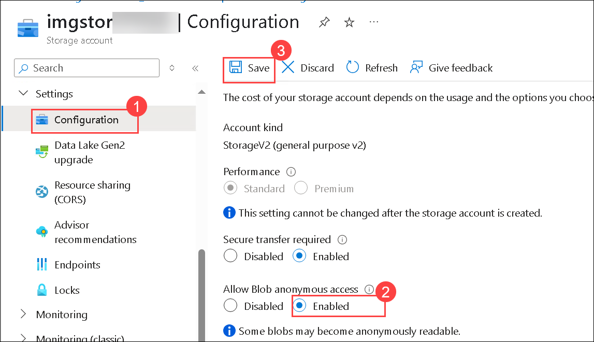

1. From the **Storage Account** blade, in the **Data storage** section, select **Containers (1)** and then select **+ Container (2)**.

    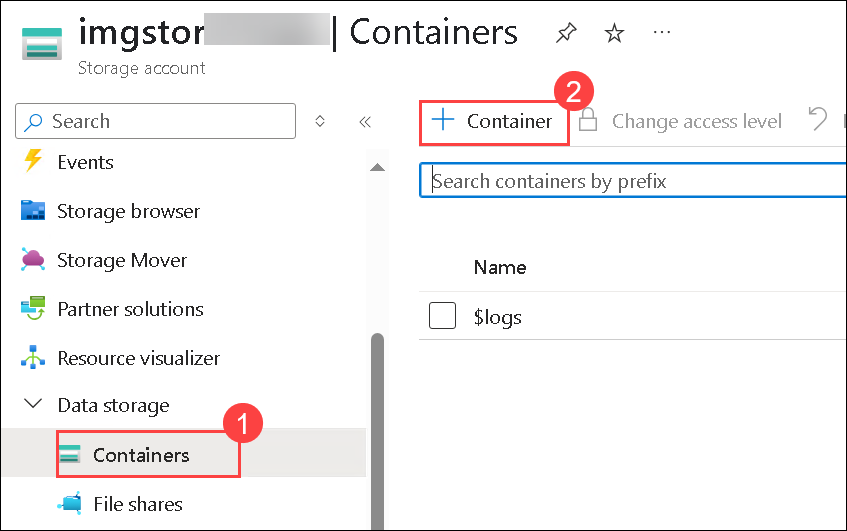

1. In the **New container** window, perform the following actions:

    | Setting                         | Action             |
    | ------------------------------- | ------------------------------------------------------------ |
    | **Name** text box | Enter **images (1)**                                   |
    | **Public access level** list      | Select **Blob (anonymous read access for blobs only) (2)**, and then select **Create (3)** |

    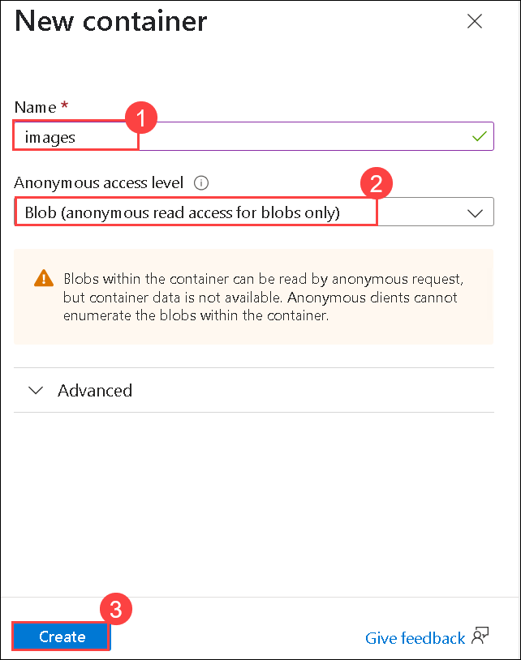    

1. In the **Containers** blade, select the newly created **images** container.

1. In the **images** blade, select **Upload (1)** and then **Browse for files (2)**.

    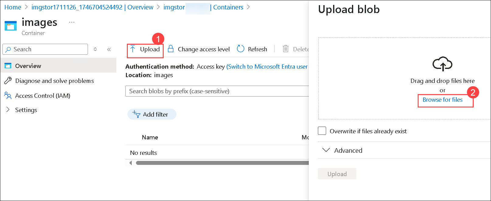

1. In the File explorer,  Browse to `C:\AllFiles\AZ-204-DevelopingSolutionsforMicrosoftAzure-master\Allfiles\Labs\01\Starter\Images` **(1)**, select the               **grilledcheese.jpg (2)** file, and then select **Open (3)**

    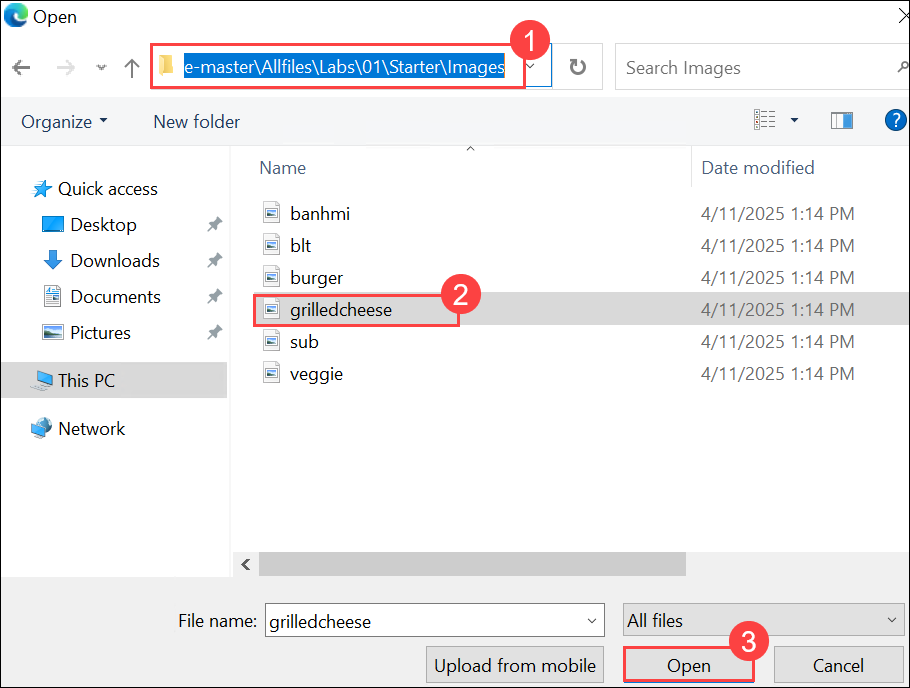

1. Ensure that the check box is selected **(1)** for **Overwrite if files already exist** and then select **Upload (2)**.

    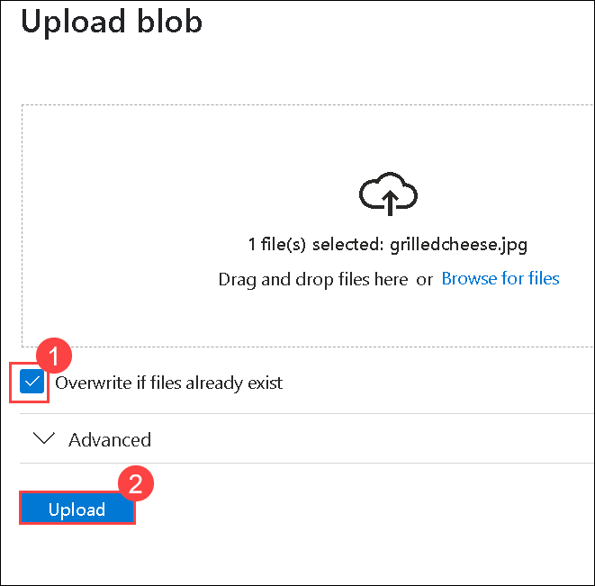
                              
    > **Note**: Wait for the blob to upload before you continue with this lab. 

    > **Congratulations** on completing the task! Now, it's time to validate it. Here are the steps:
   - Hit the Validate button for the corresponding task.
   - If you receive a success message, you can proceed to the next task.
   - If not, carefully read the error message and retry the step, following the instructions in the lab guide.
   - If you need any assistance, please contact us at labs-support@spektrasystems.com. We are available 24/7 to help you out.
 
   <validation step="8d938348-142f-4c9c-90e6-0623fd040141" />

### Task 3: Create a web app

In this task, you will create a new Azure Web App using the .NET 8 runtime on Windows, configure the hosting plan, and prepare the app for deployment by setting essential parameters and skipping monitoring setup.

1. In the Azure portal, use the **Search resources, services, and docs** text box to search for **App Service (1)**, and then in the list of results, select **App service (2)**.

    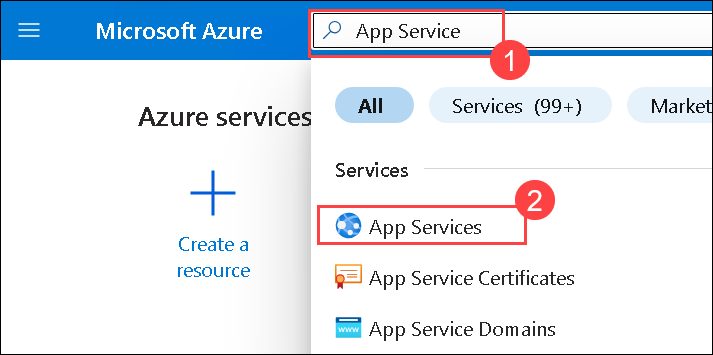

1. On the **Web App** blade, select **Create (1)** drop down and then select **+ Web App (2)**.

    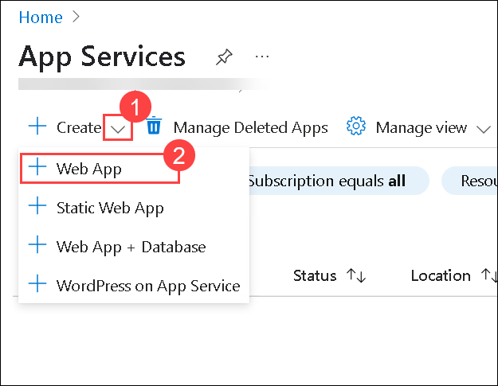

1. On the **Create Web App** blade, on the **Basics** tab, perform the following actions, and then select the **Monitor + secure** tab:

    | Setting | Action |
    | --- | --- |
    | **Subscription**    | Retain the default value **(1)** |
    | **Resource group** drop-down list          | Select **ManagedPlatform<inject key="DeploymentID" enableCopy="false"/> (2)** |
    | **Name** text box                  | Enter **imgapi<inject key="DeploymentID" enableCopy="false"/>** **(3)** |
    | **Secure unique default hostname** | **Disabled (4)**                         |
    | **Publish** section                | Select **Code (5)**  |
    | **Runtime stack** drop-down list   | Select **.NET 8 (LTS) (6)** |
    | **Operating System** section       | Select **Windows (7)**  |
    | **Region** drop-down list          | Select the **West US (8)** region  |
    | **Windows Plan (West US)** section | Select **Create new**, enter the value **ManagedPlan** in the **Name** text box, and then select **OK (9)** |
    | **Pricing plan** section | Select **Standard S1 (10)** |

    .png)
    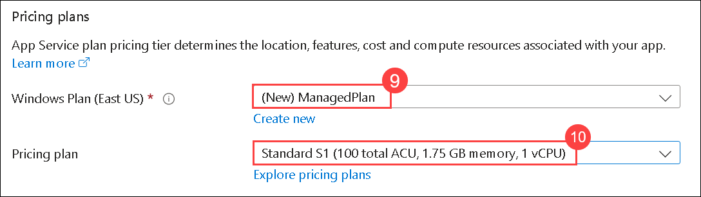    

1. Select the **Monitor + secure** tab.

    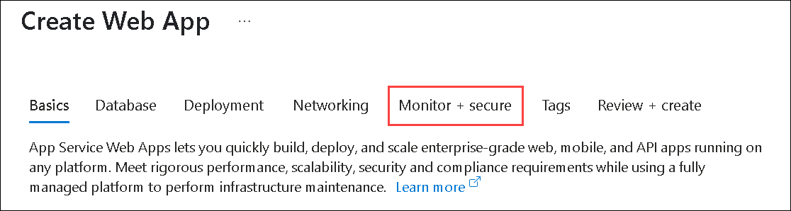   

1. On the **Monitor + secure** tab, in the **Enable Application Insights** section, select **No (1)**, and then select **Review + create (2)**.

    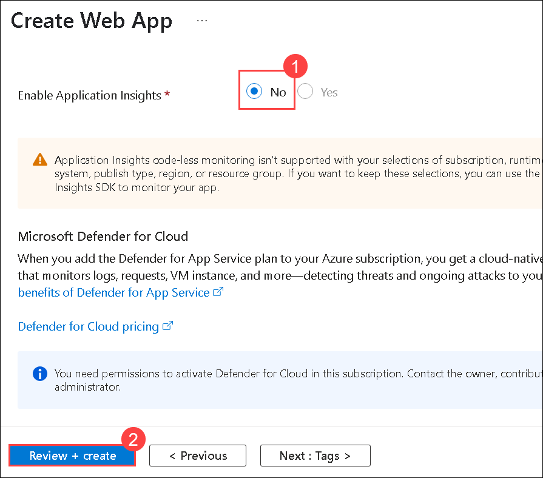   

1. On the **Review + create** tab, review the options that you selected during the previous steps.

1. Select **Create** to create the web app by using your specified configuration.

    > **Note**: Wait for the web app to be created before you continue with this lab.

1. On the **Overview** blade, select the **Go to resource** button to navigate to the blade of the newly created web app.

    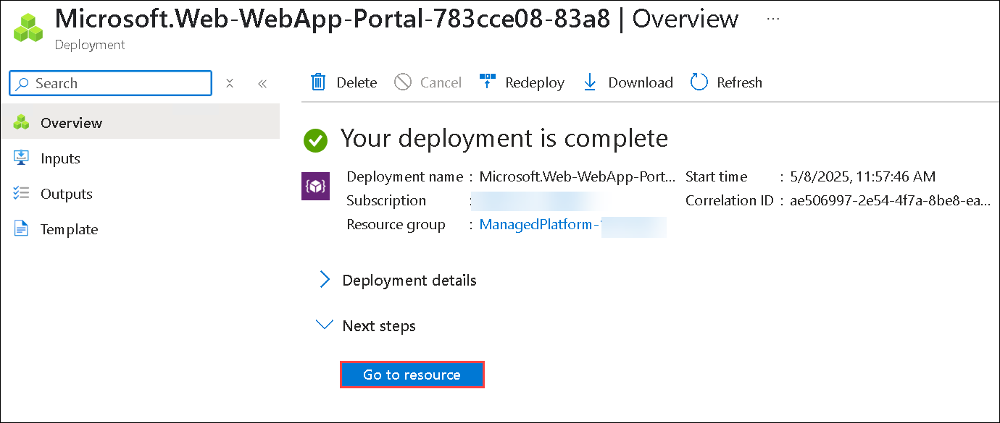   

### Task 4: Configure the web app

In this task, you will configure the web app by adding an application setting for the storage connection string and retrieving the app’s URL for later deployment use.

1. On the **App Service** blade, in the **Settings** section, select the **Environment variables (1)** link. In the **App settings** tab, select **+ Add (2)**. 

    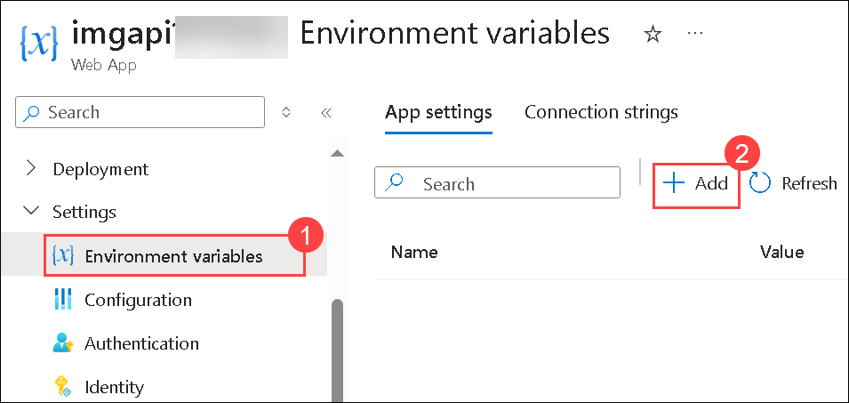   

1. Enter the following information in the **Add/Edit application setting** pop-up dialog and then select **Apply (3)**.

     | Setting | Action |
     |--|--|
     | **Name** text box | Enter **StorageConnectionString (2)** |
     | **Value** text box | Paste the storage connection string that you previously copied to Notepad **(2)** |
     | **Deployment slot setting** check box | Retain the default value |

     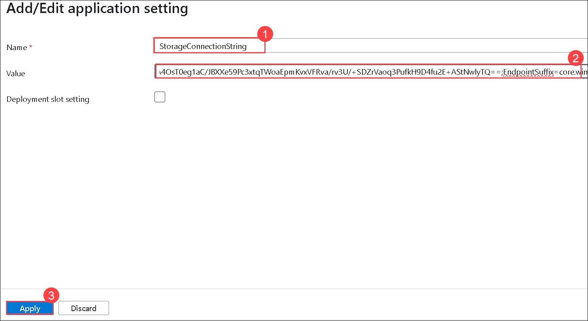     

1. At the bottom of the **App settings** section, select **Apply**.

    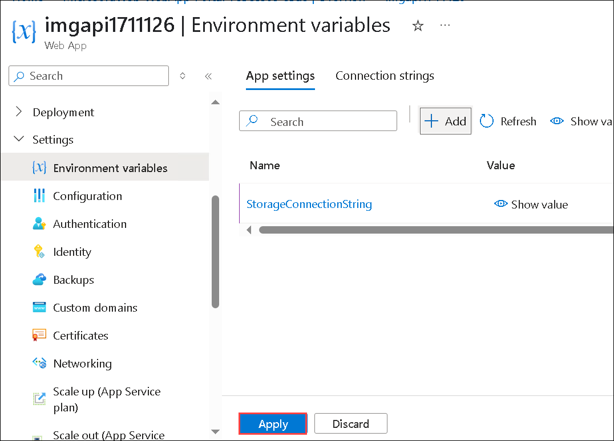
    
1. You may receive a warning that your app may restart when updating app settings. Select **Confirm**. Wait for your application settings to save before you continue with the lab.

1. To get the App Service's URL, go to the **Overview (1)**, copy the value from the **Default domain (2)** section, and then paste it to Notepad. Prepend `https://` to the domain name in Notepad. You’ll use this value later in the lab.

    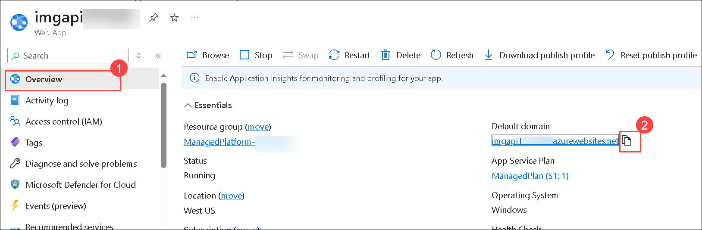

     > **Note**: At this point, the web server at this URL will return a placeholder webpage. You haven't deployed any code to the Web App yet. You'll deploy code to the Web App later in this lab.

### Task 5: Deploy an `ASP.NET` web application to Web Apps

In this task, you will deploy an ASP.NET web API application to your Azure Web App using Visual Studio Code and the Azure CLI.

1. On the desktop, double-click the **Visual Studio Code** icon.

1. On the **File (1)** menu, select **Open Folder (2)**.

    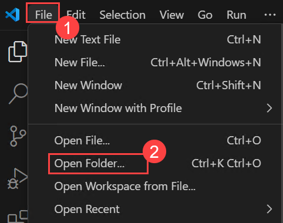

1. In the **File Explorer** window, browse to `C:\AllFiles\AZ-204-DevelopingSolutionsforMicrosoftAzure-master\Allfiles\Labs\01\Starter\API` **(1)** and then select **Select Folder (2)**.

    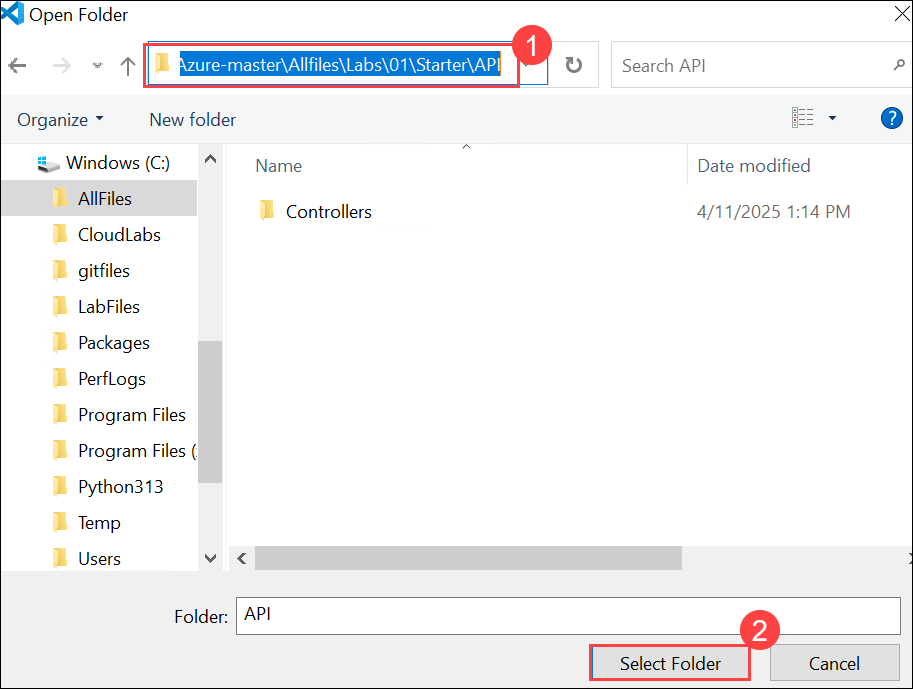

     > **Note**: Ignore any prompts to add required assets to build and debug and run the restore command to address unresolved dependencies.

1. On the **Visual Studio Code** pop-up select **Yes, I trust the authors**.

1. On the **Explorer** pane of the **Visual Studio Code** window, expand the **Controllers** folder, and then select the **ImagesController.cs** file to open the file in the editor.

    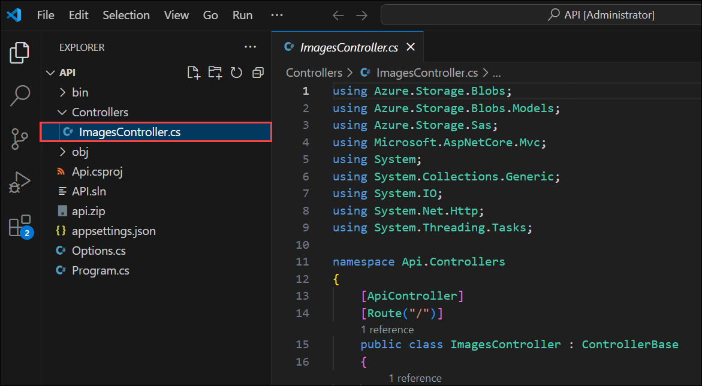

1. In the editor, in the **ImagesController** class on `line 26`, observe the **GetCloudBlobContainer** method and the code used to retrieve a container.

1. In the **ImagesController** class on `line 36`, observe the **Get** method and the code used to retrieve all blobs asynchronously from the **images** container.

1. In the **ImagesController** class on `line 68`, observe the **Post** method and the code used to persist an uploaded image to Storage.

1. In Visual Studio, go to the **Taskbar (1)**, select **Terminal (2) → New Terminal (3)**.

    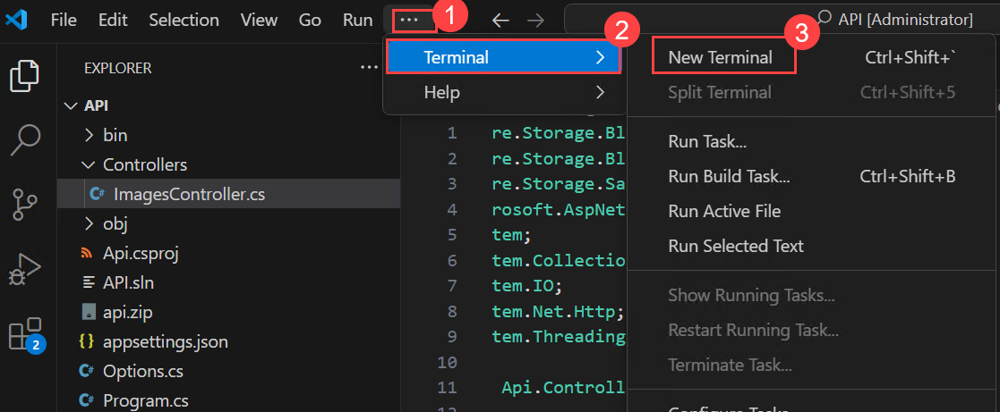

1. At the open terminal, enter the following command, and then select Enter to sign in to the Azure Command-Line Interface (CLI):

    ```
    az login
    ```

1. Minimize the VS code window.

1. In the **Microsoft Edge** browser window, select **Work or School account** and the click on **Continue**.

1. On then Sign in dialog box,
    - Enter the Email address **<inject key="AzureAdUserEmail"></inject>** 
    - Password: **<inject key="AzureAdUserPassword"></inject>** for your Microsoft account
    - Then select **Sign in**.

1. On **Automatically sign in to all desktop apps and websites on this device?** pop-up, select **No, this app only** option.

1. Return to the currently open VS code **Terminal** window. Wait for the sign-in process to finish.

1. If you see **Select a subscription and tenant (Type a number or Enter for no changes):**, simply press **Enter** to proceed without making any changes.

1. At the command prompt, enter the following command, and then select Enter to list all the apps in your **ManagedPlatform-<inject key="DeploymentID" enableCopy="false"/>** resource group:

    ```
    az webapp list --resource-group ManagedPlatform-<inject key="Deployment ID" enableCopy="false"/>
    ```

1. Enter the following command, and then select Enter to find the apps that have the **imgapi\*** prefix:

    ```
    az webapp list --resource-group ManagedPlatform-<inject key="DeploymentID" enableCopy="false"/> --query "[?starts_with(name, 'imgapi')]"
    ```

1. Enter the following command, and then click **Enter** to render only the name of the single app that has the **imgapi\*** prefix:

    ```
    az webapp list --resource-group ManagedPlatform-<inject key="DeploymentID" enableCopy="false"/> --query "[?starts_with(name, 'imgapi')].{Name:name}" --output tsv
    ```

     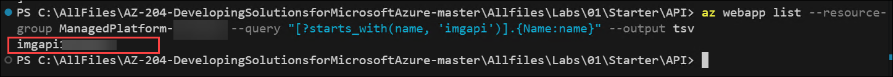    

      >**Note**: Copy and paste the web app name in the notepad.

1. Enter the following command, and then select Enter to change the current directory to the `C:\AllFiles\AZ-204-DevelopingSolutionsforMicrosoftAzure-master\Allfiles\Labs\01\Starter\API` directory that contains the lab files:

    ```
    cd C:\AllFiles\AZ-204-DevelopingSolutionsforMicrosoftAzure-master\Allfiles\Labs\01\Starter\API\
    ```

1. Enter the following command, and then select Enter to deploy the **api.zip** file to the web app that you created previously in this lab:

    ```
    az webapp deployment source config-zip --resource-group ManagedPlatform-<inject key="DeploymentID" enableCopy="false"/> --src api.zip --name <name-of-your-api-app>
    ```

    > **Note**: Replace the **`<name-of-your-api-app>`** placeholder with the name of the web app that you created previously in this lab. The one which you have copied in the previous step.You recently queried this app’s name in the previous steps.

    > **Note**: Wait for the deployment to complete before you continue with this lab.

1. Navigate back to the **Azure portal**,  search for **Resource groups (1)** and then select **Resource groups (2)**.

    

1. Go to the **ManagedPlatform-<inject key="DeploymentID" enableCopy="false"/>** resource group.

1. On the **ManagedPlatform-<inject key="DeploymentID" enableCopy="false"/>** blade, select the **imgapi<inject key="DeploymentID" enableCopy="false"/>** web app that you created previously in this lab.

    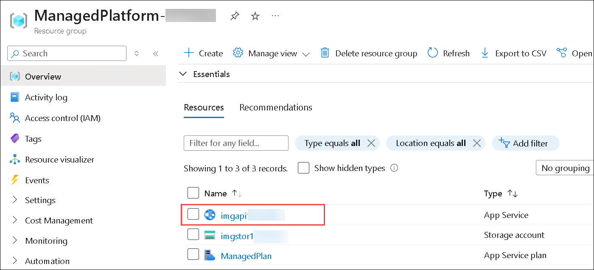

1. From the **App Service** blade, select **Browse**.

    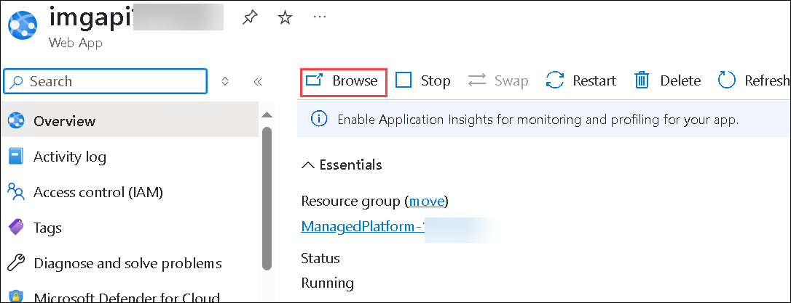

     >**Note**: The **Browse** command will perform a GET request to the root of the website, which returns a JavaScript Object Notation (JSON) array. This array should contain the URL for your single uploaded image in your Storage account.

      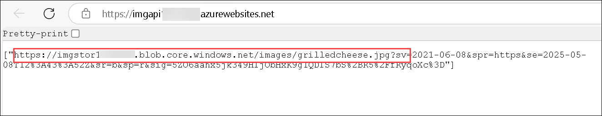     

1. Return to your browser window that contains the **Azure portal**.

1. Close the currently running Visual Studio Code and Windows Terminal applications.

    > **Congratulations** on completing the task! Now, it's time to validate it. Here are the steps:
   - Hit the Validate button for the corresponding task.
   - If you receive a success message, you can proceed to the next task.
   - If not, carefully read the error message and retry the step, following the instructions in the lab guide.
   - If you need any assistance, please contact us at labs-support@spektrasystems.com. We are available 24/7 to help you out.
 
   <validation step="0b94ad9e-01db-4cf8-8a87-d21da4a19c2c" />

### Review
In this exercise, you created a web app in Azure and then deployed your `ASP.NET` web application to Web Apps by using the Azure CLI and Apache Kudu zip file deployment utility.

## Exercise 2: Build a front-end web application by using Azure Web Apps

In this exercise, you create an Azure web app and deploy an existing web application’s code to the resource in the cloud.

### Task 1: Create a web app

In this task, you will create a new Azure Web App configured to run a .NET 8 application on a Windows environment using an existing App Service plan.

1. In the Azure portal, use the **Search resources, services, and docs** text box to search for **App Service (1)**, and then in the list of results, select **App service (2)**.

    

1. On the **Web App** blade, select **Create (1)** drop down and then select **+Web App (2)**.

    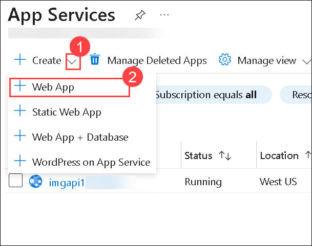

1. On the **Create Web App** blade, on the **Basics** tab, perform the following actions, and then select the **Monitor + secure** tab:

   | Setting                         | Action                                                       |
   | ------------------------------- | ------------------------------------------------------------ |
   | **Subscription**  | Retain the default value **(1)**                                    |
   | **Resource group** drop-down list     | Select **ManagedPlatform-<inject key="DeploymentID" enableCopy="false"/> (2)** |
   | **Name** text box | Enter **imgweb<inject key="DeploymentID" enableCopy="false"/> (3)** |
   | **Secure unique default hostname** | **Disabled (4)**                  |
   | **Publish** section | Select **Code (5)** |
   | **Runtime stack** drop-down list | Select **.NET 8 (LTS)** **(6)** |
   | **Operating System** section       | Select **Windows (7)**                                        |
   | **Region** drop-down list          | Select the **West US (8)** region                               |
   | **Windows Plan (West US)** section | Select **ManagedPlan (S1) (9)** |

   .png)

1. Navigate to the **Monitor + secure** tab.

    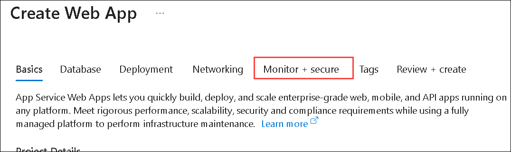

1. On the **Monitor + secure** tab, in the **Enable Application Insights** section, select **No (1)**, and then select **Review + create (2)**.

    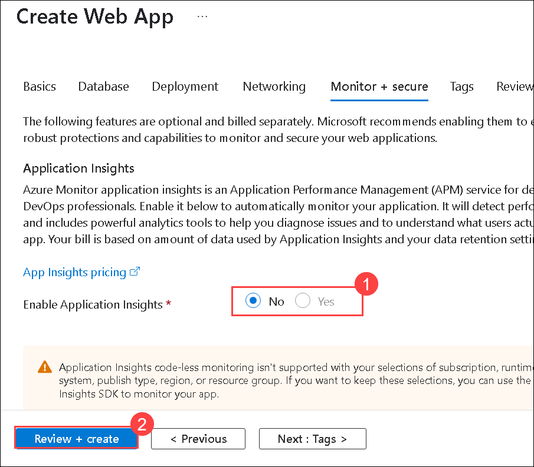

1. From the **Review + create** tab, review the options that you selected during the previous steps.

1. Select **Create** to create the web app by using your specified configuration.

   > **Note**: Wait for the creation task to complete before you continue with this lab.

1. On the **Overview** blade, select the **Go to resource** button to navigate to the blade of the newly created web app.

    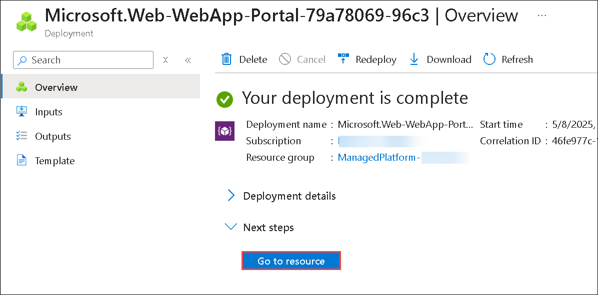

### Task 2: Configure a web app

In this task, you've configured the frontend web app to communicate with the backend API by setting an environment variable named ApiUrl. This variable holds the HTTPS URL of your previously deployed API web app, ensuring the frontend knows where to send its requests.

1. On the **App Service** blade, in the **Settings** section, select the **Environment variables (1)** and then click on **+ Add (2)**.

    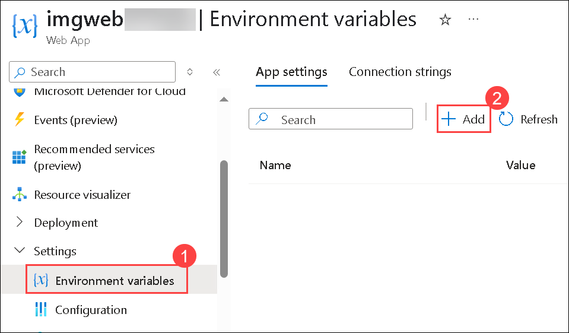

1. In the **Environment variables** section, perform the following actions, select **Save**, and then select **Continue**:

    | Setting | Action |
    |--|--|
    | **Add/Edit application setting** pop-up dialog | In the **Name** text box, enter **ApiUrl (1)** |
    | **Value** text box | Enter the web app URL that you copied previously in this lab. **Note**: Make sure you include the protocol **https://**, in the URL that you copy into the **Value** text box for this application setting **(2)** |
    | **Deployment slot setting** check box | Retain the default value **(3)**, and then select **Apply (4)** |

    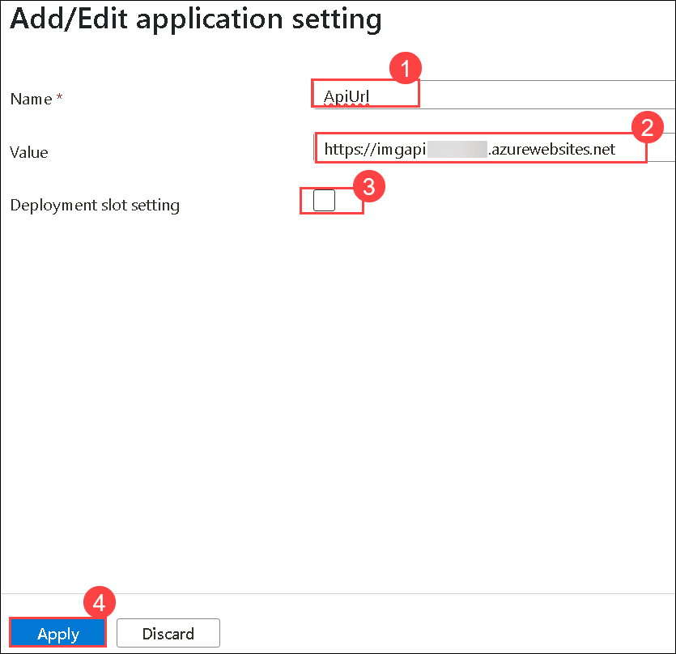

1. Click on **Apply**.

    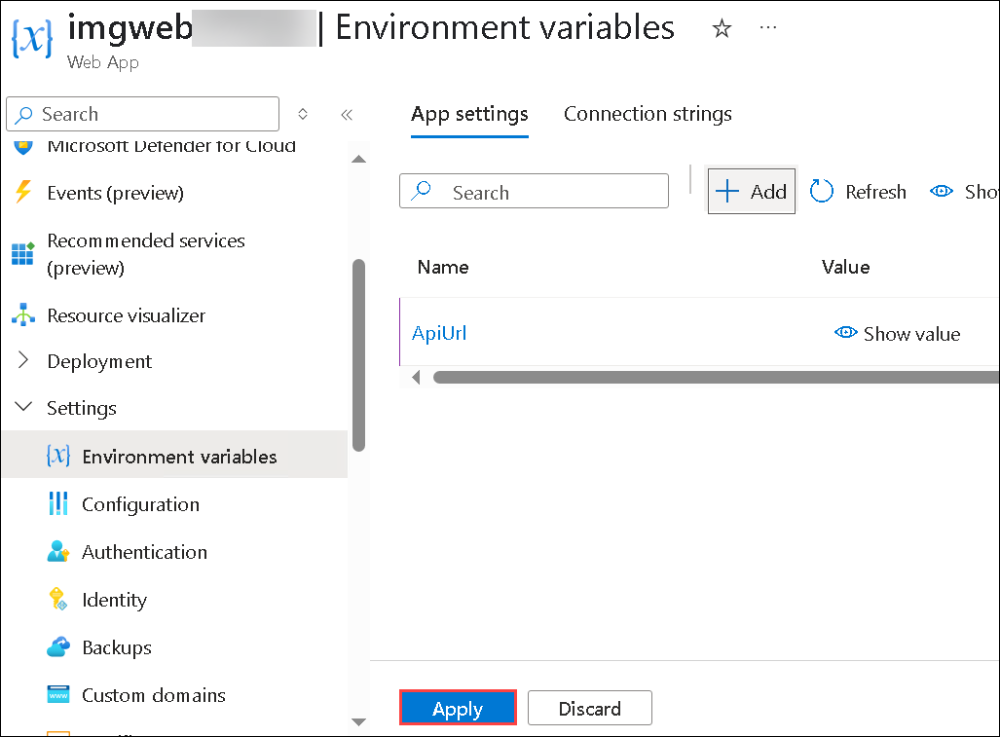

1. Then click **Confirm**, this will save the configuration value you just entered |

   > **Note**: Wait for the application settings to save before you continue with this lab.

   > **Note**: Wait for the application settings to save before you continue with this lab, for web app **URL** use the previous one which you copied in exercise 1 task 5.

### Task 3: Deploy an `ASP.NET` web application to Web Apps

In this task, you will deploy an ASP.NET frontend web application to Azure App Service, connect it to a backend API, and verify the image gallery functionality by uploading and viewing images stored in Azure Blob Storage.

1. On the desktop, double-click the **Visual Studio Code** icon.

1. On the **File (1)** menu, select **Open Folder (2)**.

    

1. In the **File Explorer** window, browse to `C:\AllFiles\AZ-204-DevelopingSolutionsforMicrosoftAzure-master\Allfiles\Labs\01\Starter\Web` **(1)**, and then select **Select Folder (2)**.

    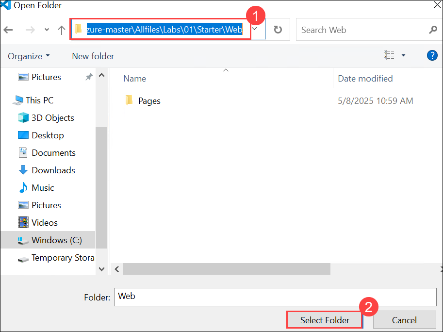

     > **Note**: Ignore any prompts to add required assets to build and debug and to run the restore command to address unresolved dependencies.

1. On the **Explorer** pane of the **Visual Studio Code** window, expand the **Pages** folder, and then select the **Index.cshtml.cs** file to open the file in the editor.

    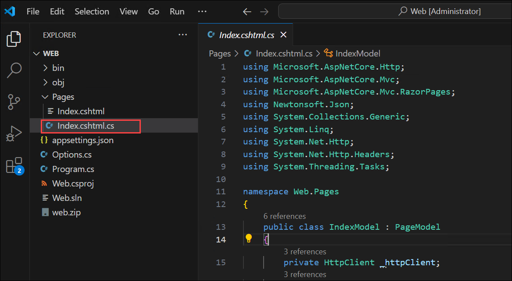

1. In the editor, in the **IndexModel** class on `line 30`, observe the **OnGetAsync** method and the code used to retrieve the list of images from the API.

1. In the **IndexModel** class on `line 41`, observe the **OnPostAsync** method and the code used to stream an uploaded image to the backend API.

1. In Visual Studio, go to the **Taskbar (1)**, select **Terminal (2) → New Terminal (3)**.

    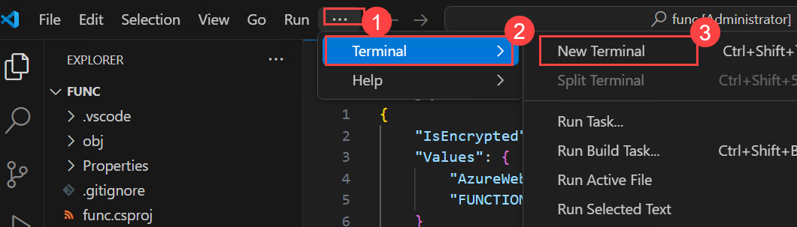

1. At the open terminal, enter the following command, and then select Enter to sign in to the Azure CLI:

    ```
    az login
    ```

1. Minimize the VS code window.    

1. In the **Microsoft Edge** browser window, select **Work or School account** and the click on **Continue**.

1. On then sign in dialog box,
    - Enter the Email address **<inject key="AzureAdUserEmail"></inject>** 
    - Password: **<inject key="AzureAdUserPassword"></inject>** for your Microsoft account
    - Then select **Sign in**.

1. On **Automatically sign in to all desktop apps and websites on this device?** pop-up, select **No, this app only** option.

1. Return to the currently open **Terminal** window. Wait for the sign-in process to finish.

1. If you see **Select a subscription and tenant (Type a number or Enter for no changes):**, simply press **Enter** to proceed without making any changes.

1. Enter the following command, and then select Enter to list all the apps in your **ManagedPlatform-<inject key="DeploymentID" enableCopy="false"/>** Resource group:

    ```
    az webapp list --resource-group ManagedPlatform-<inject key="DeploymentID" enableCopy="false"/>
    ```
    
1. Enter the following command, and then select Enter to find the apps that have the **imgweb\*** prefix:

    ```
    az webapp list --resource-group ManagedPlatform-<inject key="DeploymentID" enableCopy="false"/> --query "[?starts_with(name, 'imgweb')]"
    ```

1. Enter the following command, and then select Enter to render only the name of the single app that has the **imgweb\*** prefix:

    ```
    az webapp list --resource-group ManagedPlatform-<inject key="DeploymentID" enableCopy="false"/> --query "[?starts_with(name, 'imgweb')].{Name:name}" --output tsv
    ```

     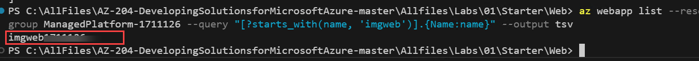   

      >**Note**: Please copy and paste the web app name in the notepad. You will be using this in the upcoming step.

1. Enter the following command, and then select Enter to change the current directory to the `C:\\AllFiles\\AZ-204-DevelopingSolutionsforMicrosoftAzure-master\\Allfiles\\Labs\\01\\Starter\\\Web` directory that contains the lab files:

    ```
    cd C:\AllFiles\AZ-204-DevelopingSolutionsforMicrosoftAzure-master\Allfiles\Labs\\01\Starter\Web\
    ```

1. Enter the following command, and then select Enter to deploy the **web.zip** file to the web app that you created previously in this lab:

    ```
    az webapp deployment source config-zip --resource-group ManagedPlatform-<inject key="DeploymentID" enableCopy="false"/> --src web.zip --name <name-of-your-web-app>
    ```

    > **Note**: Replace the **`<name-of-your-web-app\>`** placeholder with the name of the web app that you had copied in the previous step. You recently queried this app’s name in the previous steps.

    > **Note**: Wait for the deployment to complete before you continue with this lab.

1. Navigate back to the Azure portal,  search for **Resource groups (1)** and then select **Resource groups (2)**.

    

1. Then go to **ManagedPlatform-<inject key="DeploymentID" enableCopy="false"/>** Resource group.

1. On the **ManagedPlatform-<inject key="DeploymentID" enableCopy="false"/>** blade, select the **imgweb<inject key="DeploymentID" enableCopy="false"/>** web app that you created previously in this lab.

    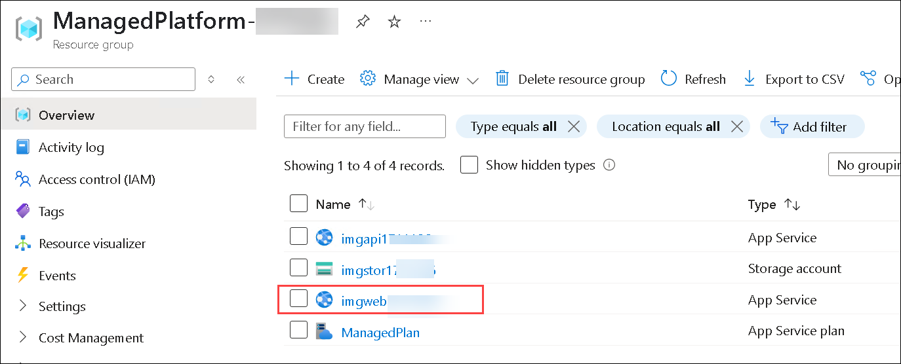

1. On the **App Service** blade, select **Browse**.

    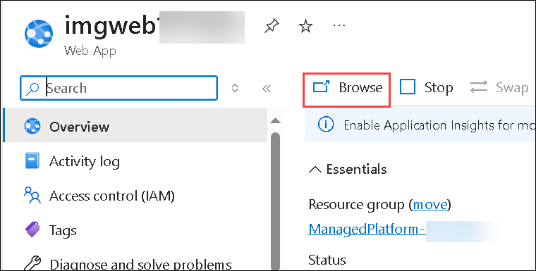

1. Observe the list of images in the gallery. The gallery should list a **single image** that was uploaded to Storage previously in the lab.

    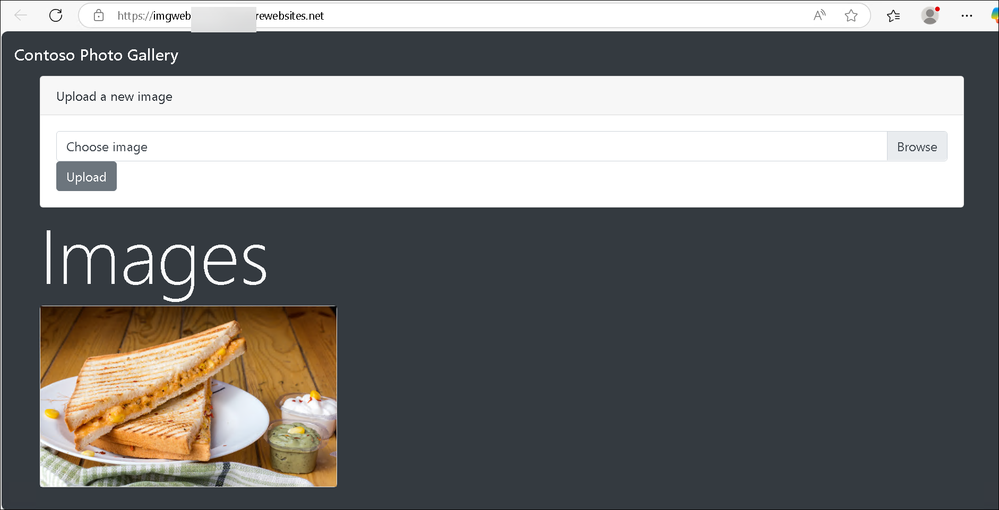

1. In the **Contoso Photo Gallery** webpage, in the **Upload a new image** section, select **Browse**.

    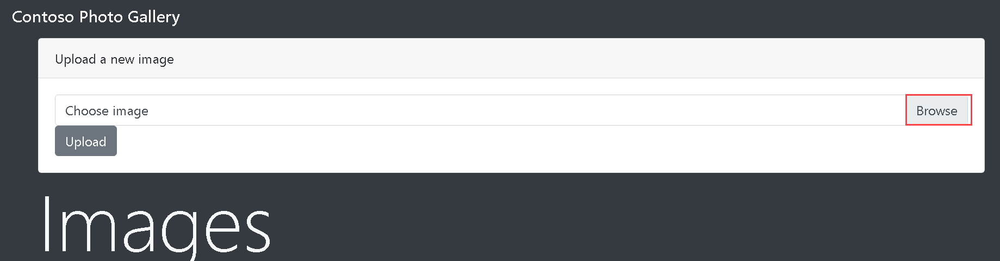

1. In the **File Explorer** window, browse to `C:\AllFiles\AZ-204-DevelopingSolutionsforMicrosoftAzure-master\Allfiles\Labs\01\Starter\Images` **(1)**, select the **bahnmi.jpg (2)** file, and then select **Open (3)**.

    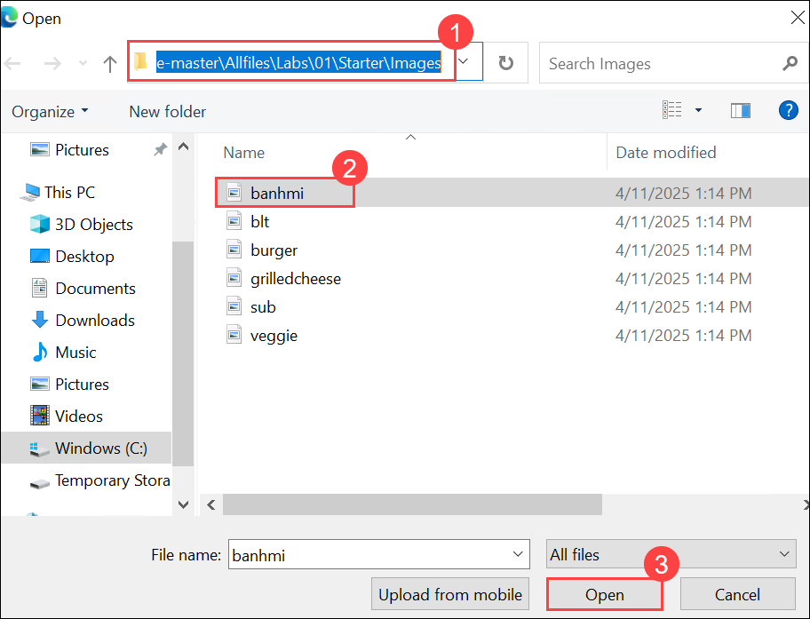

1. Then select **Upload**.

1. Observe that the list of gallery images has been updated with your new image.

   

    > **Note**: In some rare cases, you might need to refresh your browser window to retrieve the new image.

    > **Congratulations** on completing the task! Now, it's time to validate it. Here are the steps:
   - Hit the Validate button for the corresponding task.
   - If you receive a success message, you can proceed to the next task.
   - If not, carefully read the error message and retry the step, following the instructions in the lab guide.
   - If you need any assistance, please contact us at labs-support@spektrasystems.com. We are available 24/7 to help you out.
 
   <validation step="a08a994e-c230-4b9e-9a20-04a0643cecc8" />

### Review
In this exercise, you created an Azure web app and deployed an existing web application’s code to the resource in the cloud.

### Summary

In this lab, you have completed the following exercises:

- Exercise 1: Built a backend API by using Azure Storage and the Web Apps feature of Azure App Service
- Exercise 2: Built a front-end web application by using Azure Web Apps


## You have successfully completed the lab
