# Lab 03: Retrieve Azure Storage resources and metadata by using the Azure Storage SDK for .NET

## Lab Scenario

In this lab, you will learn how to use the Azure Storage SDK to access Azure Storage containers within a C# application. You will also learn how to access metadata and expose URI information to gain access to the contents of the containers in the storage account.

<em>View this video by right-clicking this **[video link](https://youtu.be/UtDXcgLv8BQ)** and select 'Open link in a new tab / new window'.</em>

## Lab Objectives

In this Lab, you will perform:

- Exercise 1: Create Azure resources
- Exercise 2: Upload a blob into a container
- Exercise 3: Access containers by using the .NET SDK
- Exercise 4: Retrieve blob Uniform Resource Identifiers (URIs) by using the .NET SDK
      
## Estimated timing: 60 minutes

## Architecture diagram


### Task 00: Lab setup and pre-requisites

Before starting this lab, you must complete **Prerequisites** of this lab.

To install **C#** extension for this lab, follow the below steps in Visual Studio code:

1. Start Visual Studio Code.

     

2. Select the **Extensions (1)** blade from the left panel. Search with **C# (2)** and select **Install (3)** to install the extension.

    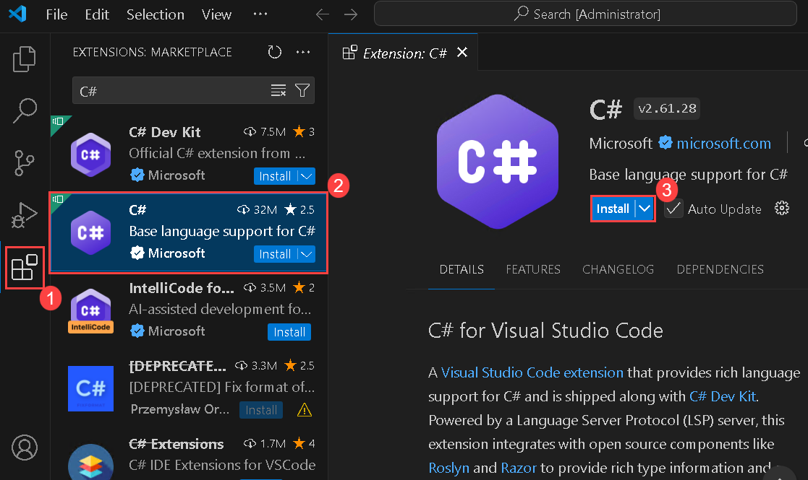

4. After installing C# extensions, close the Visual Studio code.

## Exercise 1: Create Azure resources

In this exercise, you create a new Storage account to use throughout the remaining of the lab.
    
### Task 1: Create a Storage account

In this task, you'll create a Storage account in Azure and collect the necessary details for later use.

1. In the Azure portal, use the **Search resources, services, and docs** text box to search for **Storage Accounts (1)**, and then in the list of results, select **Storage Accounts (2)**.

    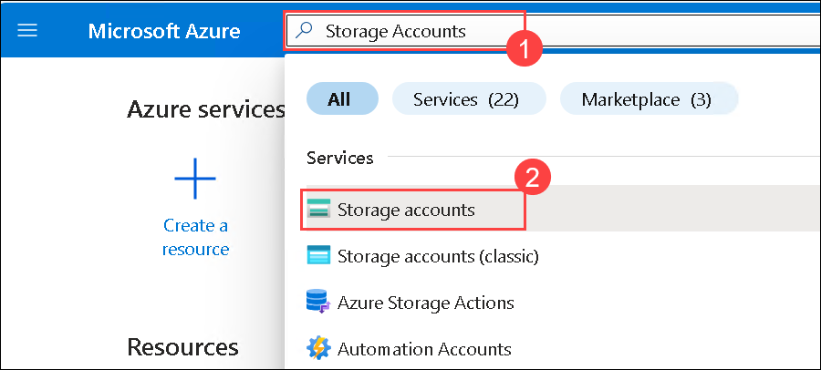

1. On the **Storage accounts** blade, select **+ Create**.

1. On the **Create a storage account** blade, on the **Basics** tab, perform the following actions, and then select **Next (7)**:

    | Setting                           | Action                                                       |
    | --------------------------------- | ------------------------------------------------------------ |
    | **Subscription**   | Retain the default value **(1)**                          |
    | **Resource group** drop-down list        | Select **StorageMedia-<inject key="DeploymentID" enableCopy="false"/> (2)** |
    | **Storage account name** text box | Enter **mediastor<inject key="DeploymentID" enableCopy="false"/> (3)** |
    | **Region** drop-down list         | Select **(US) West US (4)**      | 
    | **Primary service**               | No changes                                    |
    | **Performance** section           | Select the **Standard (5)** option                             |
    | **Redundancy** drop-down list     | Select **Locally-redundant storage (LRS) (6)**                  |

    The following screenshot displays the configured settings on the **Create a storage account blade**.
 
    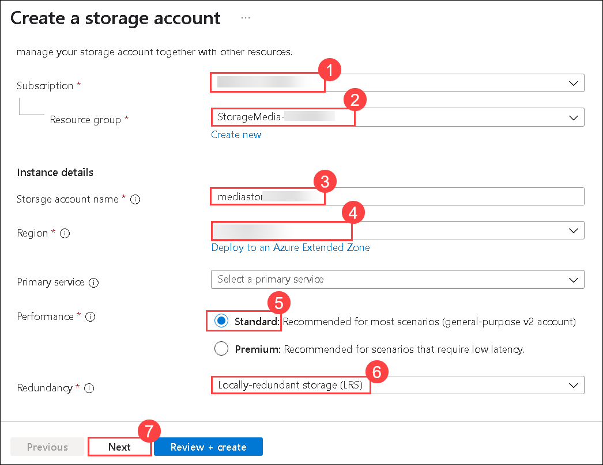

1. On the **Advanced** tab, ensure **Allow enabling anonymous access on individual containers** is checked **(1)**. Check the settings if they are not enabled, and then select **Review + create (2)**.

    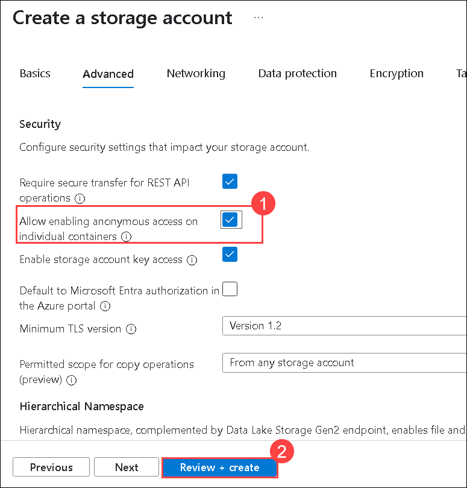
    
1. On the **Review + create** tab, review the options that you selected during the previous steps.

1. Select **Review + create** to create the storage account by using your specified configuration.

    > **Note**: Wait for the creation task to complete before you move forward with this lab.

1. Select **Go to resource**.

    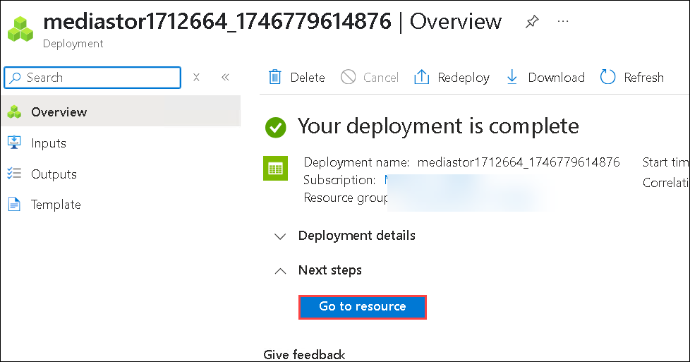

1. On the **Storage account** blade, in the **Settings (1)** section, select the **Endpoints (2)** link. In the **Endpoints** section, copy the value of the **Blob Service (3)** text box to the clipboard.

    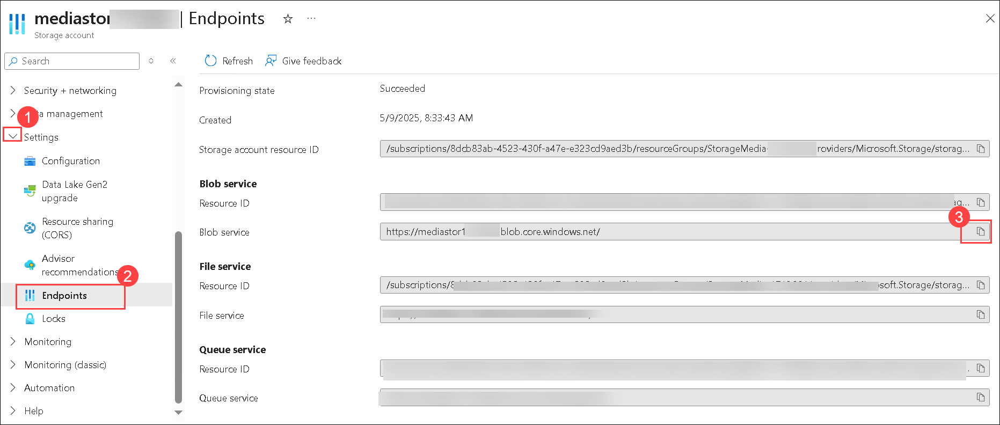

    > **Note**: You'll use this endpoint value later in the lab.

1. Open Notepad, and then paste the copied blob service value to Notepad.

1. On the **Storage account** blade, in the **Security + networking (1)** section, select **Access keys (2)**.

    - Copy the **Storage account name (3)** value to the clipboard and then paste it into Notepad.

    - On the **Access keys** blade, select **Show** for either one of the **Key (4)** text boxes. It does not matter which you use, they are interchangeable.

      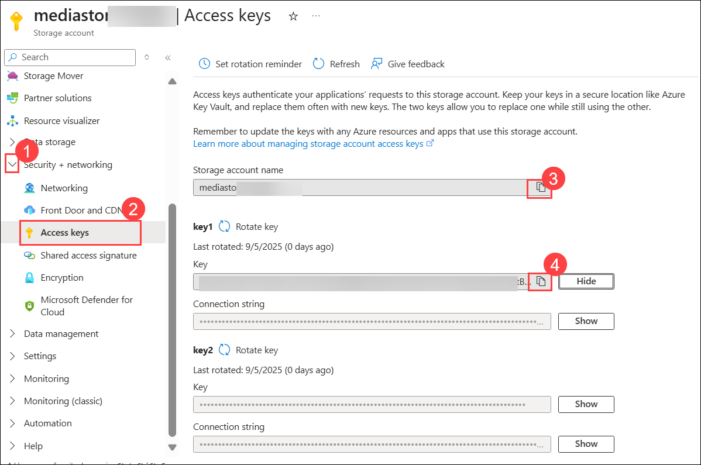

1. Review any one of the keys, and then copy the value of either of the **Key** boxes to the clipboard and then paste it into Notepad.

    > **Note**: You'll use all these values later in this lab.

### Review

In this exercise, you created a new Storage account to use throughout the remainder of the lab.

## Exercise 2: Upload a blob into a container

In this exercise, you create placeholder containers in the Storage account and then populate one of the containers with a blob.

### Task 1: Create storage account containers

In this task, you'll create two containers in your Azure Storage account to store different types of data, one for raster graphics and another for compressed audio files.

1. On the **Storage account** blade, select the **Containers** link in the **Data storage (1)** section. In the **Containers** section, select **+ Container (2)**.

    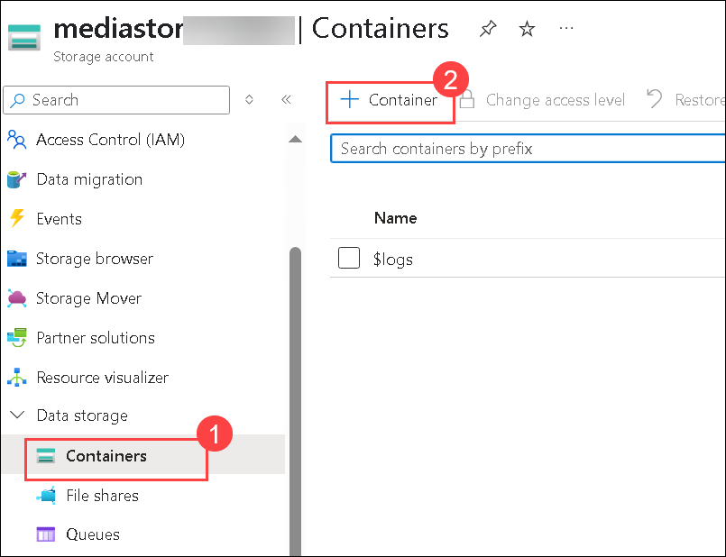

1. In the **New container** pop-up window, perform the following actions, and then select **Create (3)**:

    | Setting                                | Action                                    |
    | -------------------------------------- | ----------------------------------------- |
    | **Name** text box                      | Enter **raster-graphics (1)**               |
    | **Anonymous access level** drop-down list | Select **Private (no anonymous access) (2)** |

    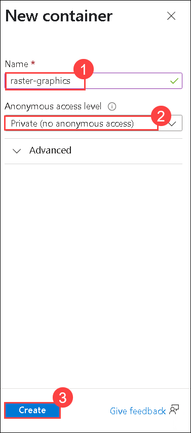    

1. In the **Containers** section, select **+ Container**.

    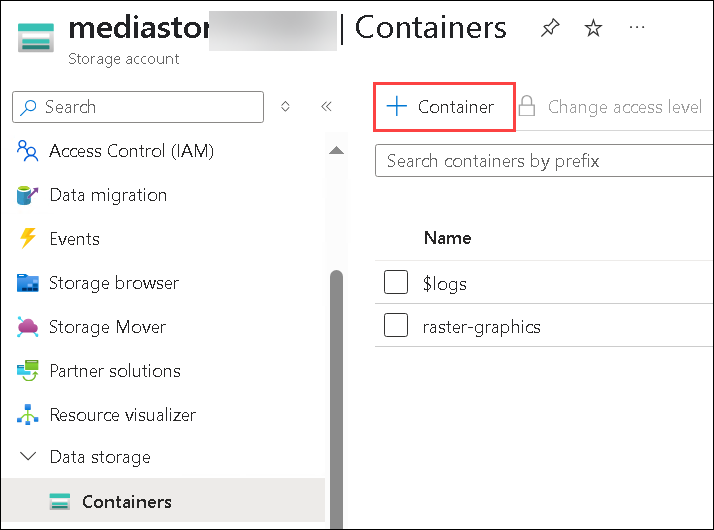

1. In the **New container** pop-up window, perform the following actions and then select **Create**:

    | Setting                                | Action                                    |
    | -------------------------------------- | ----------------------------------------- |
    | **Name** text box                      | Enter **compressed-audio**               |
    | **Public access level** drop-down list | Select **Private (no anonymous access)** |

1. In the **Containers** section, observe the updated list of containers.

    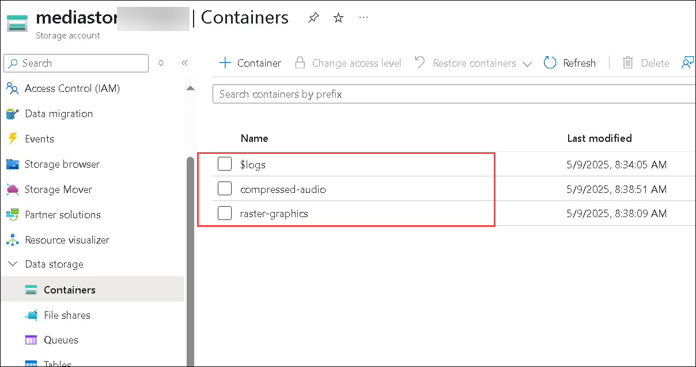


### Task 2: Upload a storage account blob

In this task, you'll upload an image file (`graph.jpg`) to the `raster-graphics` container in your Azure Storage account. This allows you to store and manage the image as a blob within Azure.

1. In the **Containers** section, select the recently created **raster-graphics** container.

    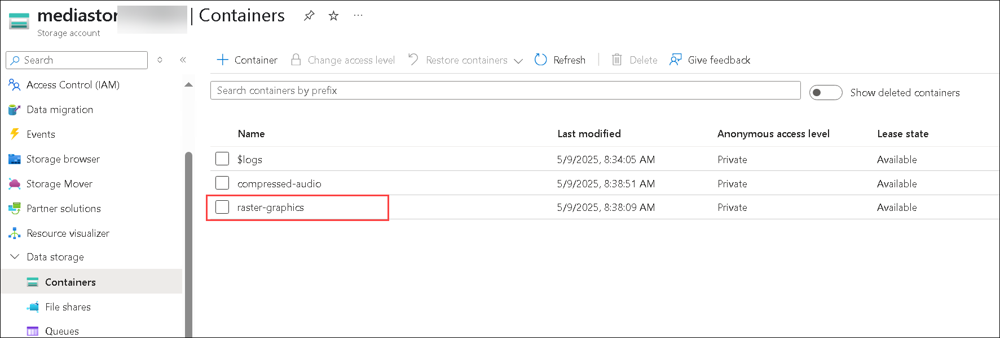

1. On the **Container** blade, select **Upload**.

1. In the **Upload blob** window, perform the following actions:

    | Setting                           | Action                                                       |
    | --------------------------------- | ------------------------------------------------------------ |
    | **Files** section   | Select the **Browse for files (1)** icon.                                   |
    | **File Explorer** window        | Browse to **C:\AllFiles\AZ-204-DevelopingSolutionsforMicrosoftAzure-master\Allfiles\Labs\03\Starter\Images (2)**, select the **graph.jpg (3)** file, and then select **Open (4)**. |

    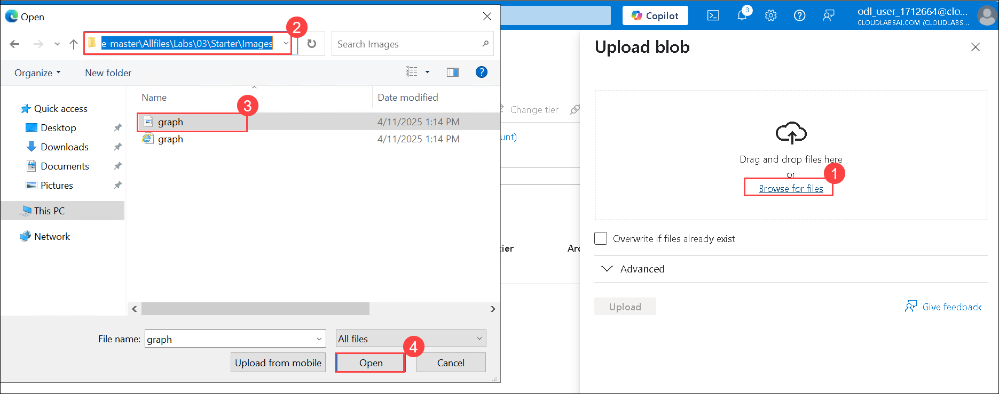

1. Ensure that the **Overwrite if files already exist** check box is selected **(1)** and then click on **Upload (2)**.

    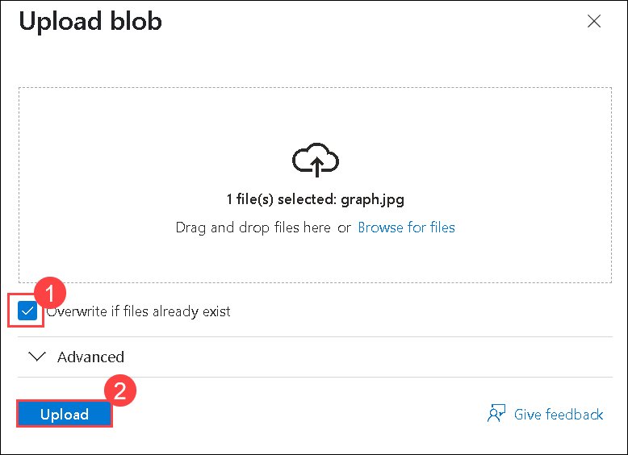      
   
    > **Note**: Wait for the blob to upload before you continue with this lab.
   
    > **Congratulations** on completing the task! Now, it's time to validate it. Here are the steps:
   - Hit the Validate button for the corresponding task.
   - If you receive a success message, you can proceed to the next task.
   - If not, carefully read the error message and retry the step, following the instructions in the lab guide.
   - If you need any assistance, please contact us at labs-support@spektrasystems.com. We are available 24/7 to help you out.
 
   <validation step="fc9ad738-78e7-411a-89ec-ae927d04b07a" />

### Review

In this exercise, you created placeholder containers in the Storage account and then populated one of the containers with a blob.

## Exercise 3: Access containers by using the .NET SDK

In this exercise, you access existing containers by using the Azure Storage SDK.

### Task 1: Create .NET project

In this task, you will create a .NET console project named **BlobManager**, set up the project environment, and install the necessary Azure.Storage.Blobs package to interact with Azure Blob Storage.

1. On the desktop, double-click the **Visual Studio Code** icon.

1. On the **File (1)** menu, select **Open Folder (2)**.

    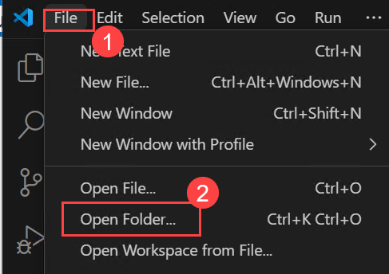

1. Browse to `C:\AllFiles\AZ-204-DevelopingSolutionsforMicrosoftAzure-master\Allfiles\Labs\03\Starter` **(1)**, then select **BlobManager (2)** Folder and then select **Select Folder (3)**.

    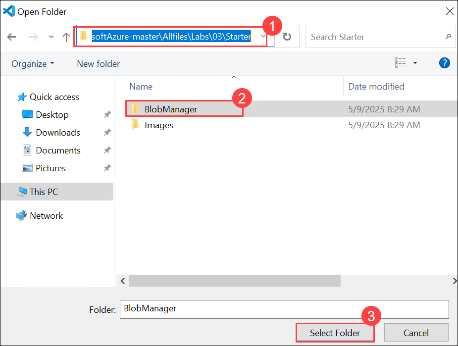

1. On the **Visual Studio Code** pop-up select **Yes, I trust the authors**.

1. In the **Visual Studio Code** window, activate the shortcut menu for the **Explorer** pane, right click on **.gitignore (1)** and then select **Open in Integrated Terminal (2)**.

    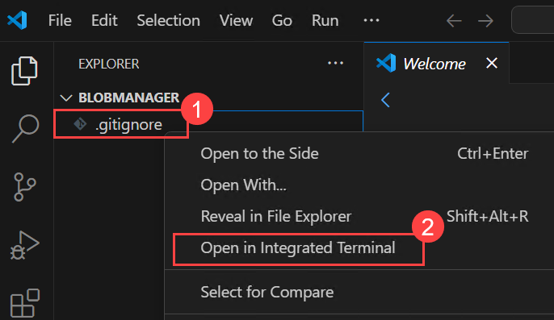

1. In the terminal, run the following command to create a new .NET project named **BlobManager** in the current folder:

    ```
    dotnet new console --framework net8.0 --name BlobManager --output .
    ```

    > **Note**: The **dotnet new** command will create a new **console** project in a folder with the same name as the project.

1. In the terminal, run the following command to import version 12.18.0 of **Azure.Storage.Blobs** from NuGet:

    ```
    dotnet add package Azure.Storage.Blobs --version 12.18.0
    ```

    > **Note**: The **dotnet add package** command will add the **Azure.Storage.Blobs** package from NuGet. For more information, refer to [Azure.Storage.Blobs](https://www.nuget.org/packages/Azure.Storage.Blobs/12.18.0).

1. In the terminal, run the following command to build the .NET web application:

    ```
    dotnet build
    ```

1. Select **Kill Terminal** or the **Recycle Bin** icon to close the currently open terminal and any associated processes.

    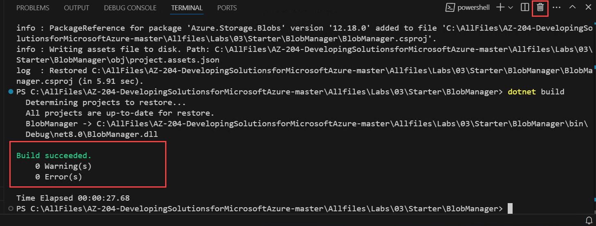

### Task 2: Modify the Program class to access Storage

In this task, you will modify the **Program.cs** file of your **BlobManager** project to include code for accessing Azure Blob Storage by setting the appropriate constants for **blobServiceEndpoint**, **storageAccountName**, and **storageAccountKey** that you recorded earlier in the lab.

1. On the **Explorer** pane of the **Visual Studio Code** window, open the **Program.cs** file.

    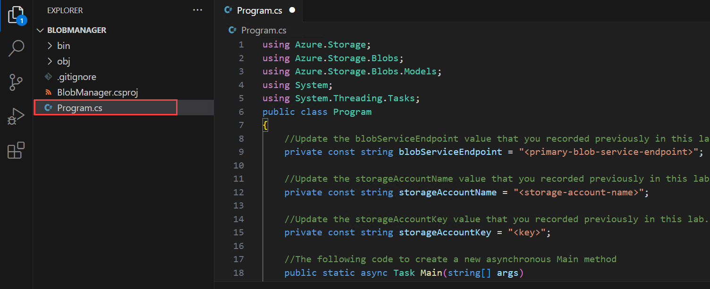

1. On the code editor tab for the **Program.cs** file, delete all the code in the existing file.

1. Add the following code:

    ```csharp
    using Azure.Storage;
    using Azure.Storage.Blobs;
    using Azure.Storage.Blobs.Models;
    using System;
    using System.Threading.Tasks;    
    public class Program
    {
        //Update the blobServiceEndpoint value that you recorded previously in this lab.        
        private const string blobServiceEndpoint = "<primary-blob-service-endpoint>";

        //Update the storageAccountName value that you recorded previously in this lab.
        private const string storageAccountName = "<storage-account-name>";

        //Update the storageAccountKey value that you recorded previously in this lab.
        private const string storageAccountKey = "<key>";    

        //The following code to create a new asynchronous Main method
        public static async Task Main(string[] args)
        { 
        }
    }
    ```

         

1. Update the **blobServiceEndpoint** string constant by setting its value to the **Primary Blob Service Endpoint** of the storage account that you recorded previously in this lab **(1)**.

1. Update the **storageAccountName** string constant by setting its value to the **Storage account name** of the storage account that you recorded previously in this lab **(2)**.

1. Update the **storageAccountKey** string constant by setting its value to the **Key** of the storage account that you recorded previously in this lab **(3)**.    

    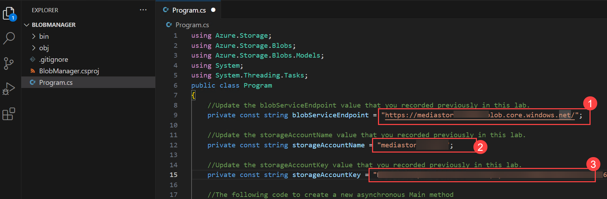

1. Use **Ctrl+S** to save the **Program.cs** file.   

### Task 3: Connect to the Azure Storage blob service endpoint

In this task, you will connect to the Azure Blob Storage service endpoint by creating an instance of the **BlobServiceClient** class using your storage account's credentials, retrieve account metadata, and display key information such as the account's name, kind, and SKU in the console.

1. In the **Main** method, add the following code:
  
    ```csharp
    public static async Task Main(string[] args)
    {
        //The following line of code to create a new instance of the StorageSharedKeyCredential class by using the storageAccountName and storageAccountKey constants as constructor parameters
        StorageSharedKeyCredential accountCredentials = new StorageSharedKeyCredential(storageAccountName, storageAccountKey);

        //The following line of code to create a new instance of the BlobServiceClient class by using the blobServiceEndpoint constant and the accountCredentials variable as constructor parameters
        BlobServiceClient serviceClient = new BlobServiceClient(new Uri(blobServiceEndpoint), accountCredentials);

        //The following line of code to invoke the GetAccountInfoAsync method of the BlobServiceClient class to retrieve account metadata from the service
        AccountInfo info = await serviceClient.GetAccountInfoAsync();

        //Render a welcome message
        await Console.Out.WriteLineAsync($"Connected to Azure Storage Account");

        //Render the storage account's name
        await Console.Out.WriteLineAsync($"Account name:\t{storageAccountName}");

        //Render the type of storage account
        await Console.Out.WriteLineAsync($"Account kind:\t{info?.AccountKind}");

        //Render the currently selected stock keeping unit (SKU) for the storage account
        await Console.Out.WriteLineAsync($"Account sku:\t{info?.SkuName}");
    }
    ```

     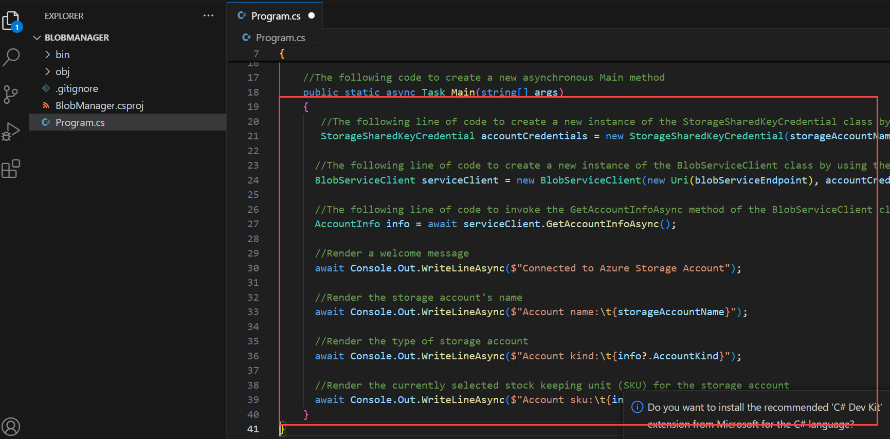

      >**Note**: Please add the code as shown in the above screenshot. Take care about the brackets.

1. Save the **Program.cs** file.

1. In Visual Studio, go to the **Taskbar (1)**, select **Terminal (2) → New Terminal (3)**.

    

1. In the terminal, run the following command to run the .NET web application:

    ```
    dotnet run
    ```

    > **Note**: If there are any build errors, review the **Program.cs** file in the **Windows (C):\AllFiles\AZ-204-DevelopingSolutionsforMicrosoftAzure-master\Labs\03\\Solution\\BlobManager** folder.

1. Observe the output from the currently running console application. The output contains metadata for the **storage account** that was retrieved from the service.

    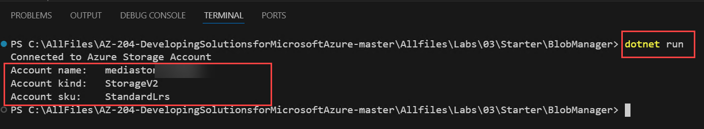

1. Select **Kill Terminal** or the **Recycle Bin** icon to close the currently open terminal and any associated processes.

### Task 4: Enumerate the existing containers

In this task, you will add a method to enumerate and display the names of all existing containers in the Azure Blob Storage account. This involves creating an asynchronous method that uses the **GetBlobContainersAsync** method to retrieve the list of containers and display them in the console.

1. In the **Program** class, enter the following code below the main method to create a new **private static** method named **EnumerateContainersAsync**, that's asynchronous and has a single **BlobServiceClient** parameter type **(1)**:
   
    ```csharp
    private static async Task EnumerateContainersAsync(BlobServiceClient client)
    {   
        /*Create an asynchronous foreach loop that iterates over the results of 
            an invocation of the GetBlobContainersAsync method of the BlobServiceClient class. */    
        await foreach (BlobContainerItem container in client.GetBlobContainersAsync())
        {   
            //Print the name of each container
            await Console.Out.WriteLineAsync($"Container:\t{container.Name}");
        }
    }
    ```

1. In the **Main** method, enter the following code at the end of the method to invoke the **EnumerateContainersAsync** method, passing in the *serviceClient* variable as a parameter **(2)**:

    ```csharp
    await EnumerateContainersAsync(serviceClient);
    ```

     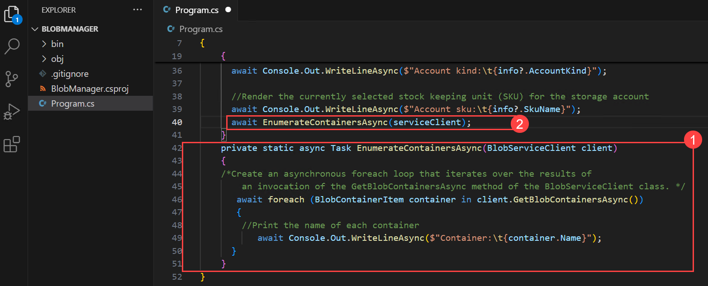   

      >**Note:** Please take care about the brackets as shown in the Screenshot. 

1. Observe the **Program.cs** file, which should now include:

    ```csharp
    using Azure.Storage;
    using Azure.Storage.Blobs;
    using Azure.Storage.Blobs.Models;
    using System;
    using System.Threading.Tasks;
    
    public class Program
    {
        private const string blobServiceEndpoint = "your blobServiceEndpoint";
        private const string storageAccountName = "your storageAccountName";
        private const string storageAccountKey = "your storageAccountKey";    
        public static async Task Main(string[] args)
        {
            StorageSharedKeyCredential accountCredentials = new StorageSharedKeyCredential(storageAccountName, storageAccountKey);
            BlobServiceClient serviceClient = new     BlobServiceClient(new Uri(blobServiceEndpoint), accountCredentials);
            AccountInfo info = await serviceClient.GetAccountInfoAsync();
            await Console.Out.WriteLineAsync($"Connected to Azure Storage Account");
            await Console.Out.WriteLineAsync($"Account name:\t{storageAccountName}");
            await Console.Out.WriteLineAsync($"Account kind:\t{info?.AccountKind}");
            await Console.Out.WriteLineAsync($"Account sku:\t{info?.SkuName}");

            /* To invoke the EnumerateContainersAsync method, 
            passing in the serviceClient variable as a parameter */
            await EnumerateContainersAsync(serviceClient);
        }        
        private static async Task EnumerateContainersAsync(BlobServiceClient client)
        {        
            await foreach (BlobContainerItem container in client.GetBlobContainersAsync())
            {
                await Console.Out.WriteLineAsync($"Container:\t{container.Name}");
            }
    }
    }
    ```

1. Use **Ctrl+S** to save the **Program.cs** file.

1. In the **Visual Studio Code** window, on the Menu Bar, click on the **elipses (...) (1)**, select **Terminal (2)** and then select **New Terminal (3)**.

    

1. In the terminal, run the following command to run the .NET web application:

    ```
    dotnet run
    ```

    > **Note**: If there are any build errors, review the **Program.cs** file in the **Windows (C):\AllFiles\AZ-204-DevelopingSolutionsforMicrosoftAzure-master\Labs\03\\Solution\\BlobManager** folder.

1. Observe the output from the currently running console application. The updated output includes a list of every existing **container** in the account.

    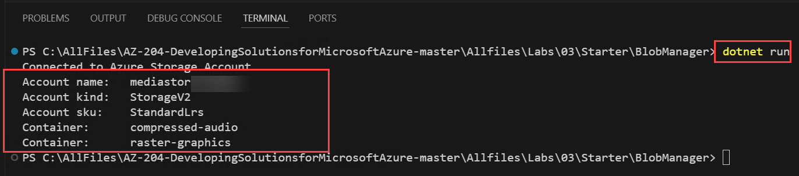

1. Select **Kill Terminal** or the **Recycle Bin** icon to close the currently open terminal and any associated processes.

### Review

In this exercise, you accessed existing containers by using the Azure Storage SDK.

## Exercise 4: Retrieve blob Uniform Resource Identifiers (URIs) by using the .NET SDK

In this exercise, you create containers and manage blobs by using the Storage SDK.

### Task 1: Enumerate the blobs in an existing container by using the SDK

In this task, you will extend your application by creating a method to enumerate the blobs within an existing container. This method uses the **GetBlobContainerClient** and **GetBlobsAsync** methods to retrieve and display the names of all blobs in the specified container. You'll then call this method in the **Main** function to list the blobs in the **raster-graphics** container.

1. In the **Program** class, enter the following code below the previously added method to create a new **private static** method named **EnumerateBlobsAsync** that's asynchronous and has two parameter types, **BlobServiceClient** and **string**:
  
    ```csharp
    private static async Task EnumerateBlobsAsync(BlobServiceClient client, string containerName)
    {   
        /* Get a new instance of the BlobContainerClient class by using the
           GetBlobContainerClient method of the BlobServiceClient class, 
           passing in the containerName parameter */   
        BlobContainerClient container = client.GetBlobContainerClient(containerName);

        /* Render the name of the container that will be enumerated */
        await Console.Out.WriteLineAsync($"Searching:\t{container.Name}");

        /* Create an asynchronous foreach loop that iterates over the results of
            an invocation of the GetBlobsAsync method of the BlobContainerClient class */
        await foreach (BlobItem blob in container.GetBlobsAsync())
        {     
            //Print the name of each blob    
            await Console.Out.WriteLineAsync($"Existing Blob:\t{blob.Name}");
        }
    }
    ```

    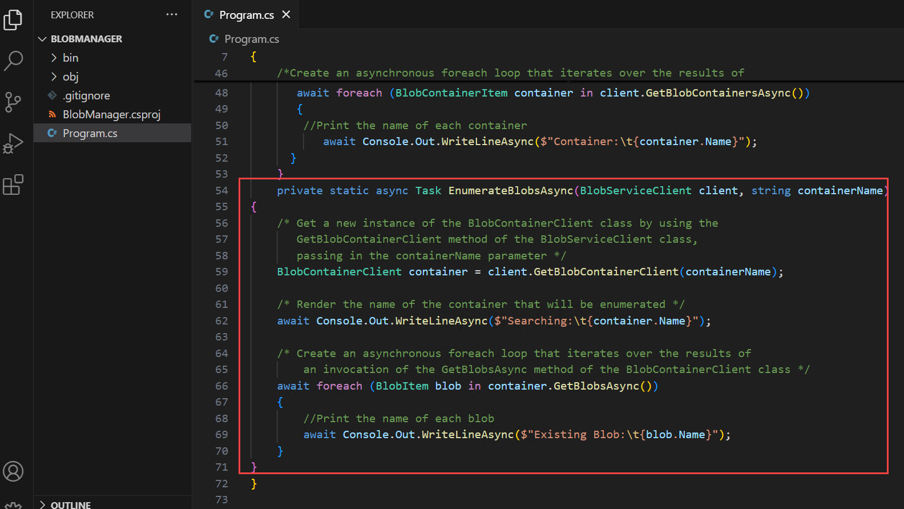    

1. In the **Main** method, enter the following code at the end of the method to create a variable named *existingContainerName* with a value of **raster-graphics**:

    ```csharp
    string existingContainerName = "raster-graphics";
    ```

1. In the **Main** method, enter the following code at the end of the method to invoke the **EnumerateBlobsAsync** method, passing in the *serviceClient* and *existingContainerName* variables as parameters:

    ```csharp
    await EnumerateBlobsAsync(serviceClient, existingContainerName);
    ```

1. Observe the **Program.cs** file, which should now include:

    ```csharp
    using Azure.Storage;
    using Azure.Storage.Blobs;
    using Azure.Storage.Blobs.Models;
    using System;
    using System.Threading.Tasks;    
    public class Program
    {
        private const string blobServiceEndpoint = "your blobServiceEndpoint";
        private const string storageAccountName = "your storageAccountName";
        private const string storageAccountKey = "your storageAccountKey";    
        public static async Task Main(string[] args)
        {
            StorageSharedKeyCredential accountCredentials = new StorageSharedKeyCredential(storageAccountName, storageAccountKey);
            BlobServiceClient serviceClient = new   BlobServiceClient(new Uri(blobServiceEndpoint), accountCredentials);
            AccountInfo info = await serviceClient.GetAccountInfoAsync();
            await Console.Out.WriteLineAsync($"Connected to Azure Storage Account");
            await Console.Out.WriteLineAsync($"Account name:\t{storageAccountName}");
            await Console.Out.WriteLineAsync($"Account kind:\t{info?.AccountKind}");
            await Console.Out.WriteLineAsync($"Account sku:\t{info?.SkuName}");
            await EnumerateContainersAsync(serviceClient);
            string existingContainerName = "raster-graphics";
            await EnumerateBlobsAsync(serviceClient, existingContainerName);
        }        
        private static async Task EnumerateContainersAsync(BlobServiceClient client)
        {        
            await foreach (BlobContainerItem container in client.GetBlobContainersAsync())
            {
                await Console.Out.WriteLineAsync($"Container:\t{container.Name}");
            }
        }        
        private static async Task EnumerateBlobsAsync(BlobServiceClient client, string containerName)
        {      
            BlobContainerClient container = client.GetBlobContainerClient(containerName);
            await Console.Out.WriteLineAsync($"Searching:\t{container.Name}");
            await foreach (BlobItem blob in container.GetBlobsAsync())
            {        
                await Console.Out.WriteLineAsync($"Existing Blob:\t{blob.Name}");
            }
        }
    }
    ```

1. Use **Ctrl+S** to save the **Program.cs** file.

1. In Visual Studio, go to the **Taskbar (1)**, select **Terminal (2) → New Terminal (3)**.

    

1. In the terminal, run the following command to run the .NET web application:

    ```
    dotnet run
    ```

    > **Note**: If there are any build errors, review the **Program.cs** file in the **Windows (C):\AllFiles\AZ-204-DevelopingSolutionsforMicrosoftAzure-master\Labs\03\\Solution\\BlobManager** folder.

1. Review the output from the currently running console application. The updated output includes metadata about the existing container and blobs.

    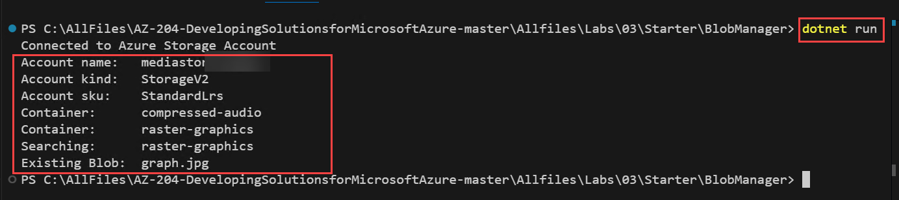

1. Select **Kill Terminal** or the **Recycle Bin** icon to close the currently open terminal and any associated processes.

### Task 2: Create a new container by using the SDK

In this task, you create a new container named **vector-graphics** in Azure Storage using the SDK. The **GetContainerAsync** method checks if the container exists, creates it if not, and prints the container's name to the console.

1. In the **Program** class, enter the following code to create a new **private static** method named **GetContainerAsync** that's asynchronous and has two parameter types, **BlobServiceClient** and **string**:

    ```csharp
    private static async Task<BlobContainerClient> GetContainerAsync(BlobServiceClient client, string containerName)
    {   
        /* Get a new instance of the BlobContainerClient class by using the
            GetBlobContainerClient method of the BlobServiceClient class,
            passing in the containerName parameter */   
        BlobContainerClient container = client.GetBlobContainerClient(containerName);

        /* Invoke the CreateIfNotExistsAsync method of the BlobContainerClient class */
        await container.CreateIfNotExistsAsync(PublicAccessType.Blob);

        /* Render the name of the container that was potentially created */
        await Console.Out.WriteLineAsync($"New Container:\t{container.Name}");

        /* Return the container as the result of the GetContainerAsync */        
        return container;
    }
    ```

     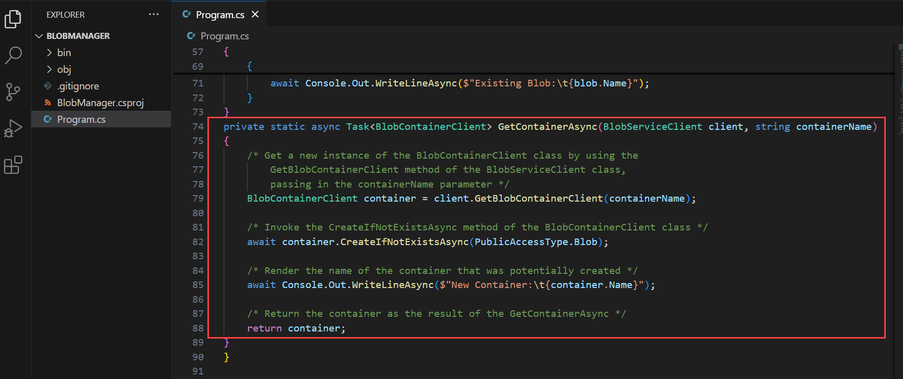    

1. In the **Main** method, enter the following code at the end of the method to create a variable named *newContainerName* with a value of **vector-graphics**:

    ```csharp
    string newContainerName = "vector-graphics";
    ```

1. In the **Main** method, enter the following code at the end of the method to invoke the **GetContainerAsync** method, to pass the *serviceClient* and *newContainerName* variables as parameters, and to store the result in a variable named *containerClient* of type **BlobContainerClient**:

    ```csharp
    BlobContainerClient containerClient = await GetContainerAsync(serviceClient, newContainerName);
    ```

1. Review the **Program.cs** file, which should now include:

    ```csharp
    using Azure.Storage;
    using Azure.Storage.Blobs;
    using Azure.Storage.Blobs.Models;
    using System;
    using System.Threading.Tasks;    
    public class Program
    {
        private const string blobServiceEndpoint = "your blobServiceEndpoint";
        private const string storageAccountName = "your storageAccountName";
        private const string storageAccountKey = "your storageAccountKey";
        public static async Task Main(string[] args)
        {
            StorageSharedKeyCredential accountCredentials = new StorageSharedKeyCredential(storageAccountName, storageAccountKey);
            BlobServiceClient serviceClient = new BlobServiceClient(new Uri(blobServiceEndpoint), accountCredentials);
            AccountInfo info = await serviceClient.GetAccountInfoAsync();
            await Console.Out.WriteLineAsync($"Connected to Azure Storage Account");
            await Console.Out.WriteLineAsync($"Account name:\t{storageAccountName}");
            await Console.Out.WriteLineAsync($"Account kind:\t{info?.AccountKind}");
            await Console.Out.WriteLineAsync($"Account sku:\t{info?.SkuName}");
            await EnumerateContainersAsync(serviceClient);
            string existingContainerName = "raster-graphics";
            await EnumerateBlobsAsync(serviceClient, existingContainerName);
            string newContainerName = "vector-graphics";
            BlobContainerClient containerClient = await GetContainerAsync(serviceClient, newContainerName);
        }        
        private static async Task EnumerateContainersAsync(BlobServiceClient client)
        {        
            await foreach (BlobContainerItem container in client.GetBlobContainersAsync())
            {
                await Console.Out.WriteLineAsync($"Container:\t{container.Name}");
            }
        }        
        private static async Task EnumerateBlobsAsync(BlobServiceClient client, string containerName)
        {      
            BlobContainerClient container = client.GetBlobContainerClient(containerName);
            await Console.Out.WriteLineAsync($"Searching:\t{container.Name}");
            await foreach (BlobItem blob in container.GetBlobsAsync())
            {        
                await Console.Out.WriteLineAsync($"Existing Blob:\t{blob.Name}");
            }
        }        
        private static async Task<BlobContainerClient> GetContainerAsync(BlobServiceClient client, string containerName)
        {      
            BlobContainerClient container = client.GetBlobContainerClient(containerName);
            await container.CreateIfNotExistsAsync(PublicAccessType.Blob);
            await Console.Out.WriteLineAsync($"New Container:\t{container.Name}");
            return container;
        }
    }
    ```

1. Save the **Program.cs** file.

1. In Visual Studio, go to the **Taskbar (1)**, select **Terminal (2) → New Terminal (3)**.

    

1. In the terminal, run the following command to run the .NET web application:

    ```
    dotnet run
    ```

    > **Note**: If there are any build errors, review the **Program.cs** file in the **Windows (C):\AllFiles\AZ-204-DevelopingSolutionsforMicrosoftAzure-master\Labs\03\\Solution\\BlobManager** folder.

1. Observe the output from the currently running console application. The updated output includes metadata about the existing container and blobs.

    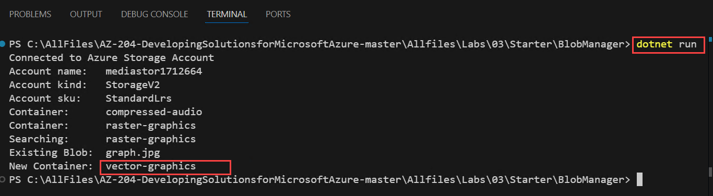

1. Select **Kill Terminal** or the **Recycle Bin** icon to close the currently open terminal and any associated processes.

### Task 3: Upload a new blob by using the portal

In this task, you will learn how to upload a new blob to an Azure storage container using the Azure portal.

1. Navigate back to **Azure portal**, search for **Resource groups (1)** then select the **Resource groups (2)** .

    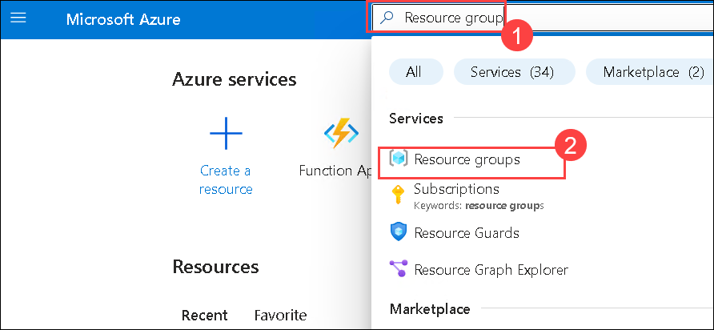

1. On the **Resource groups** blade, select the **StorageMedia** resource group that you created previously in this lab.

1. On the **StorageMedia** blade, select the **mediastor<inject key="DeploymentID" enableCopy="false"/>** storage account that you created previously in this lab.

1. On the **Storage account** blade, select the **Containers** link in the **Data storage (1)** section. In the **Containers** section, select the newly created **vector-graphics (2)** container. You might need to refresh the page to observe the new container.

    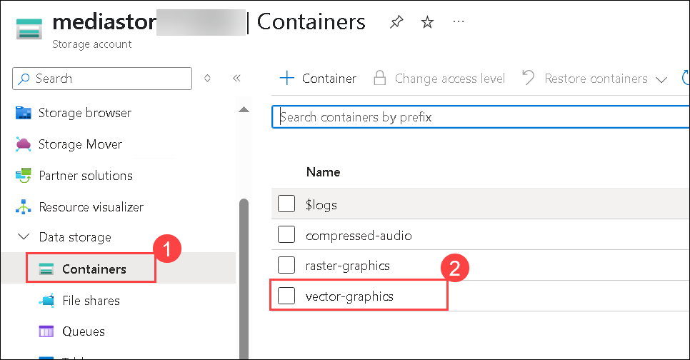

1. On the **Container** blade, select **Upload**.

1. In the **Upload blob** window, perform the following actions:

    | Setting                           | Action                                                       |
    | --------------------------------- | ------------------------------------------------------------ |
    | **Files** section   | Select **Browse for files (1)** or use the drag and drop feature                                   |
    | **File Explorer** window        | Browse to `C:\AllFiles\AZ-204-DevelopingSolutionsforMicrosoftAzure-master\Allfiles\Labs\03\Starter\Images` **(2)**, select the **graph.svg (3)** file, and then select **Open (4)**. |

    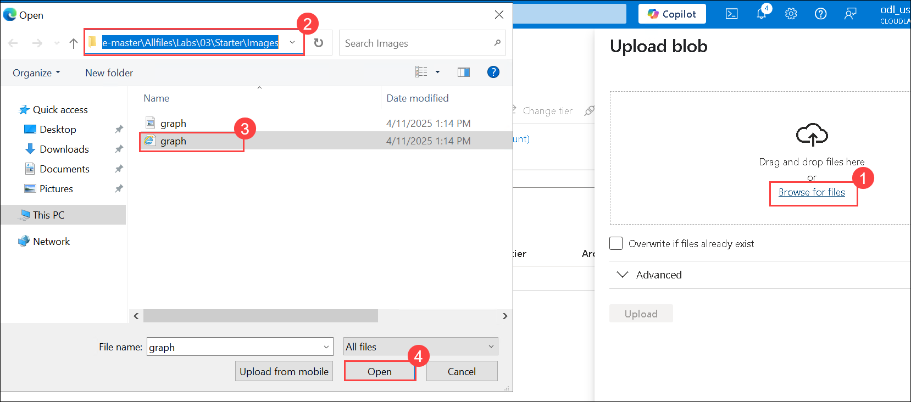

1. Ensure that the **Overwrite if files already exist** check box is selected **(1)** and then select **Upload (2)**.

    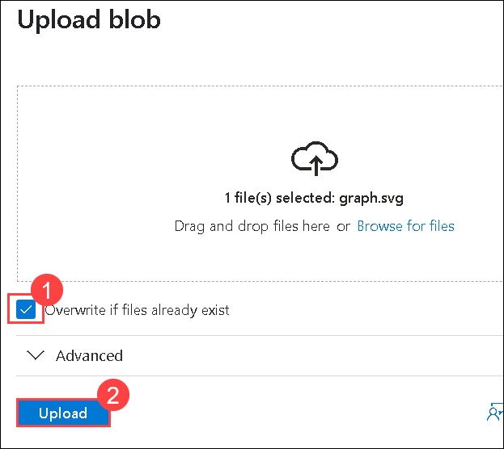
   
    > **Note**: Wait for the blob to upload before you continue with this lab.
    
    > **Congratulations** on completing the task! Now, it's time to validate it. Here are the steps:
   - Hit the Validate button for the corresponding task.
   - If you receive a success message, you can proceed to the next task.
   - If not, carefully read the error message and retry the step, following the instructions in the lab guide.
   - If you need any assistance, please contact us at labs-support@spektrasystems.com. We are available 24/7 to help you out.
 
   <validation step="d32ca64b-f37b-49d0-b646-01917cde0145" />

### Task 4: Access blob URI by using the SDK

In this task, you will retrieve the URI of a blob stored in Azure Blob Storage using the .NET SDK.

1. Switch to the **Visual Studio Code** window.

1. In the **Program** class, enter the following code to create a new **private static** method named **GetBlobAsync** that's asynchronous and has two parameter types, **BlobContainerClient** and **string**:
   
    ```csharp
    private static async Task<BlobClient> GetBlobAsync(BlobContainerClient client, string blobName)
    {      
        BlobClient blob = client.GetBlobClient(blobName);
        bool exists = await blob.ExistsAsync();
        if (!exists)
        {
            await Console.Out.WriteLineAsync($"Blob {blob.Name} not found!");
            
        }
        else
            await Console.Out.WriteLineAsync($"Blob Found, URI:\t{blob.Uri}");
        return blob;
    }
    ```

1. In the **Main** method, enter the following code at the end of the method to create a variable named *uploadedBlobName* with a value of **graph.svg**:

    ```csharp
    string uploadedBlobName = "graph.svg";
    ```

1. In the **Main** method, enter the following code at the end of the method to invoke the **GetBlobAsync** method, passing in the *containerClient* and *uploadedBlobName* variables as parameters, and to store the result in a variable named *blobClient* of type **BlobClient**:

    ```csharp
    BlobClient blobClient = await GetBlobAsync(containerClient, uploadedBlobName);
    ```

1. In the **Main** method, enter the following code at the end of the method to render the **Uri** property of the *blobClient* variable:

    ```csharp
    await Console.Out.WriteLineAsync($"Blob Url:\t{blobClient.Uri}");
    ```

     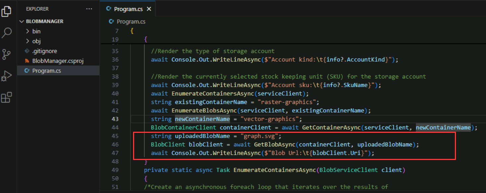    

1. Observe the **Program.cs** file, which should now include:

    ```csharp
    using Azure.Storage;
    using Azure.Storage.Blobs;
    using Azure.Storage.Blobs.Models;
    using System;
    using System.Threading.Tasks;    
    public class Program
    {
        private const string blobServiceEndpoint = "your blobServiceEndpoint";
        private const string storageAccountName = "your storageAccountName";
        private const string storageAccountKey = "your storageAccountKey";    
        public static async Task Main(string[] args)
        {
            StorageSharedKeyCredential accountCredentials = new StorageSharedKeyCredential(storageAccountName, storageAccountKey);
            BlobServiceClient serviceClient = new BlobServiceClient(new Uri(blobServiceEndpoint), accountCredentials);
            AccountInfo info = await serviceClient.GetAccountInfoAsync();
            await Console.Out.WriteLineAsync($"Connected to Azure Storage Account");
            await Console.Out.WriteLineAsync($"Account name:\t{storageAccountName}");
            await Console.Out.WriteLineAsync($"Account kind:\t{info?.AccountKind}");
            await Console.Out.WriteLineAsync($"Account sku:\t{info?.SkuName}");
            await EnumerateContainersAsync(serviceClient);
            string existingContainerName = "raster-graphics";
            await EnumerateBlobsAsync(serviceClient, existingContainerName);
            string newContainerName = "vector-graphics";
            BlobContainerClient containerClient = await GetContainerAsync(serviceClient, newContainerName);
            string uploadedBlobName = "graph.svg";
            BlobClient blobClient = await GetBlobAsync(containerClient, uploadedBlobName);
            await Console.Out.WriteLineAsync($"Blob Url:\t{blobClient.Uri}");
        }        
        private static async Task EnumerateContainersAsync(BlobServiceClient client)
        {        
            await foreach (BlobContainerItem container in client.GetBlobContainersAsync())
            {
                await Console.Out.WriteLineAsync($"Container:\t{container.Name}");
            }
        }        
        private static async Task EnumerateBlobsAsync(BlobServiceClient client, string containerName)
        {      
            BlobContainerClient container = client.GetBlobContainerClient(containerName);
            await Console.Out.WriteLineAsync($"Searching:\t{container.Name}");
            await foreach (BlobItem blob in container.GetBlobsAsync())
            {        
                await Console.Out.WriteLineAsync($"Existing Blob:\t{blob.Name}");
            }
        }        
        private static async Task<BlobContainerClient> GetContainerAsync(BlobServiceClient client, string containerName)
        {      
            BlobContainerClient container = client.GetBlobContainerClient(containerName);

            await container.CreateIfNotExistsAsync(PublicAccessType.Blob);
            await Console.Out.WriteLineAsync($"New Container:\t{container.Name}");
            return container;
        }        
        private static async Task<BlobClient> GetBlobAsync(BlobContainerClient client, string blobName)
        {      
            BlobClient blob = client.GetBlobClient(blobName);
            bool exists = await blob.ExistsAsync();
            if (!exists)
            {
                await Console.Out.WriteLineAsync($"Blob {blob.Name} not found!");
                
            }
            else
                await Console.Out.WriteLineAsync($"Blob Found, URI:\t{blob.Uri}");
            return blob;
        }
    }
    ```

1. Save the **Program.cs** file.

1. In Visual Studio, go to the **Taskbar (1)**, select **Terminal (2) → New Terminal (3)**.

    

1. In the terminal, run the following command to run the .NET web application:

    ```
    dotnet run
    ```

    > **Note**: If there are any build errors, review the **Program.cs** file in the **Windows (C):\AllFiles\AZ-204-DevelopingSolutionsforMicrosoftAzure-master\Labs\03\\Solution\\BlobManager** folder.

1. Observe the output from the currently running console application. The updated output includes the final URL to access the blob online. Record the value of this **URL** to use later in the lab.

    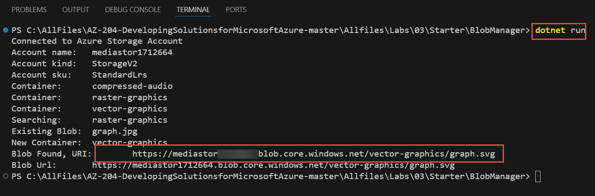

     > **Note**: The URL will likely be similar to the following string: `https://mediastor*[Deploymentid]*.blob.core.windows.net/vector-graphics/graph.svg`

1. Select **Kill Terminal** or the **Recycle Bin** icon to close the currently open terminal and any associated processes.

    > **Congratulations** on completing the task! Now, it's time to validate it. Here are the steps:
   - Hit the Validate button for the corresponding task.
   - If you receive a success message, you can proceed to the next task.
   - If not, carefully read the error message and retry the step, following the instructions in the lab guide.
   - If you need any assistance, please contact us at labs-support@spektrasystems.com. We are available 24/7 to help you out.
 
   <validation step="ab79e3e1-8214-425e-8801-600ffa57311b" />

### Task 5: Test the URI by using a browser

In this task, you will test the blob's URI by opening it in a browser.

1. On the taskbar, activate the shortcut menu for the **Microsoft Edge** icon, and then select **New window**.

1. In the new browser window, paste the URL in the browser tab that you previously copied in this lab for the blob.

1. You should now notice the Scalable Vector Graphics (SVG) file in your browser window.

    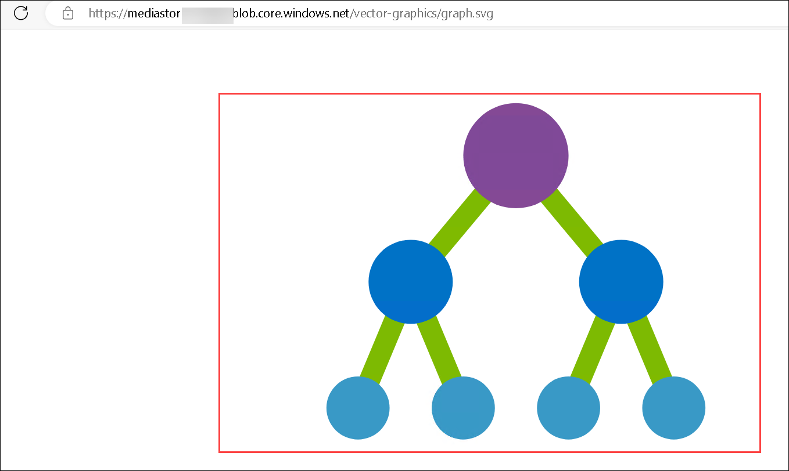

### Review

In this exercise, you created containers and managed blobs by using the Storage SDK.

### Summary

In this lab, you have completed the following exercises:

- Exercise 1: Created Azure resources
- Exercise 2: Uploaded a blob into a container
- Exercise 3: Accessed containers by using the .NET SDK
- Exercise 4: Retrieved blob Uniform Resource Identifiers (URIs) by using the .NET SDK

## You have successfully completed the lab
